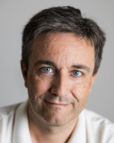

## Group leader
  
[Lars Juhl Jensen](/people/larsjuhljensen/)

## Current group members
[Dhouha Grissa](http://dgrissa.wixsite.com/dhouha-grissa)  
[Katerina Nastou](https://www.linkedin.com/in/katerina-nastou-ba8378b9/)  
[Marc Legeay](/people/marclegeay/)  
[Marie Locard-Paulet](/people/marielocardpaulet/)  
[Nadezhda Tsankova Doncheva](/people/nadezhdatdoncheva/)  
[Oana Palasca](https://www.linkedin.com/in/oanapalasca/)  
[Rebecca Kirsch](https://www.linkedin.com/in/rebecca-kirsch/)  
[Ufuk Kirik](/people/ufukkirik/)

## Alumni
Albert Pallejà Caro ([Clinical-Microbiomics A/S](https://www.clinical-microbiomics.com))  
Alberto Santos Delgado ([University of Copenhagen, Mann group](http://www.cpr.ku.dk/research/proteomics/mann-group/))  
[Alexander Junge](/people/alexanderjunge/) ([Novo Nordisk A/S](https://www.novonordisk.com/))  
Damian Szklarczyk ([University of Zurich, Mering group](http://www.imls.uzh.ch/en/research/vonmering/))  
David Lyon ([University of Zurich, Mering group](http://www.imls.uzh.ch/en/research/vonmering/))  
Heiko Horn ([Broad Institute, Lage group](http://www.lagelab.org/))  
Helen Victoria Cook ([University of Cambridge, School of Clinical Medicine](https://www.medschl.cam.ac.uk/))  
Jan Christian Refsgaard ([Intomics A/S](https://www.intomics.com/))  
Kalliopi Tsafou ([Georgetown University, Toretsky group](http://toretsky.georgetown.edu/))  
Sune Pletscher-Frankild ([Intomics A/S](https://www.intomics.com/))  
Xiaoyong Pan ([Erasmus Medical Center](https://www.erasmusmc.nl/?lang=en))
