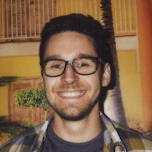

<alexander.junge@cpr.ku.dk>

## Research interests

My research focuses on biomedical text mining of large corpora. I combine supervised machine learning approaches with unsupervised, co-occurrence based techniques to infer associations between genes, proteins, chemicals, or diseases. My main research goal is to assist scientists in the generation of actionable hypothesis based on the newest findings published in the biomedical literature.

I am currently developing CoCoScore, a context-aware co-occurrence scoring scheme for text mining applications. CoCoScore is available on [GitHub](https://github.com/JungeAlexander/cocoscore) under an open license.

## Brief CV

- *04/2017--present*: Postdoctoral researcher in biomedical text mining at the [Novo Nordisk Foundation Center for Protein Research](http://www.cpr.ku.dk/), University of Copenhagen, Denmark.
- *03/2014--03/2017*: PhD student in theoretical and applied RNA Bioinformatics at the [Center for non-coding RNA in Technology and Health (RTH)](http://rth.dk/) under the supervision of Jan Gorodkin, PhD.
- *10/2011--02/2014*: Master of Science in Bioinformatics, Saarland University, Saarbrücken, Germany. Thesis supervisor: Dr Jan Baumbach
- *03/2013--08/2013*: Research stay in the [research group on Computational Biology](http://www.baumbachlab.net/) at University of Southern Denmark, Odense, Denmark.
- *08/2011--12/2011*: Semester abroad, Linköping University, Linköping, Sweden
- *10/2008--08/2011*: Bachelor of Science in Bioinformatics (Computational Molecular Biology), Saarland University, Saarbrücken, Germany. Thesis supervisor: Dr Dr Thomas Lengauer

Full curriculum vitae as `.pdf` is available upon request.

## Other places to find me

[Personal website](http://www.alexanderjunge.net/)  
[Google Scholar](https://scholar.google.com/citations?user=80t0eDYAAAAJ&hl=en)  
[Twitter](https://twitter.com/JungeAlexander)  
[GitHub](https://github.com/JungeAlexander)  
[LinkedIn](https://www.linkedin.com/in/alexanderjunge)  
[Staff website at University of Copenhagen](http://www.cpr.ku.dk/staff/jensen-group/?pure=en/persons/477194)  
