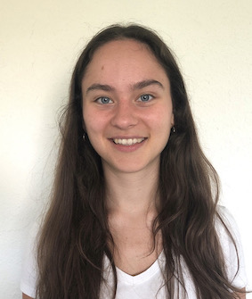

<henrietta.holze@cpr.ku.dk>

<!--   -->

## Experience

- **May 2021 -- present**: 
Research assistant at the [Novo Nordisk Foundation Center for Protein Research](http://www.cpr.ku.dk/), University of Copenhagen, Denmark.
- **October 2020 -- May 2021**: 
Research assistant at Rigshospitalet, Copenhagen, Denmark.
- **May 2020 -- July 2020**:
Internship in Bioinformatics at BASF SE, Ludwigshafen, Germany. 
- **October 2019 -- February 2020**: 
Internship in the team of Dr. Georg Zeller at the [European Molecular Biology Laboratory](https://www.embl.org/sites/heidelberg/), Heidelberg, Germany. 
- **March 2019 -- August 2019**:
Bachelor thesis at the [Institute for Evolution and Biodiversity](https://www.uni-muenster.de/Evolution/), University of Muenster, Germany. 

## Education

- **September 2020 -- present**:
MSc Bioinformatics, University of Copenhagen, Denmark.
- **October 2016 -- August 2019**:
BSc Biosciences, University of Muenster, Germany. 

## Other places to find me

[ORCID](https://orcid.org/0000-0003-1589-3887)  \
[Github](https://github.com/HenriettaHolze)  \
[Linkedin](www.linkedin.com/in/henrietta-holze-49665a18a)
