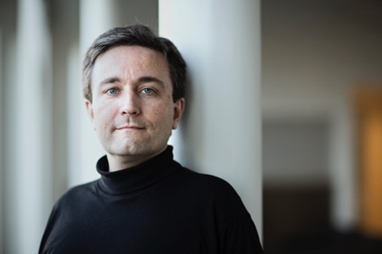

[lars.juhl.jensen@cpr.ku.dk](mailto:lars.juhl.jensen@cpr.ku.dk)

  

## Mini biography

Lars Juhl Jensen started his research career in Søren Brunak’s group at the [Technical University of Denmark (DTU)](http://www.dtu.dk/), from where he in 2002 received the Ph.D. degree in bioinformatics for his work on non-homology based protein function prediction. During this time, he also developed methods for visualization of microbial genomes, pattern recognition in promoter regions, and microarray analysis. From 2003 to 2008, he was at the [European Molecular Biology Laboratory (EMBL)](https://www.embl.de/) where he worked on literature mining, integration of large-scale experimental datasets, and analysis of biological interaction networks. Since 2009, he has continued this line of research as a professor at the [Novo Nordisk Foundation Center for Protein Research](http://www.cpr.ku.dk/) at the [University of Copenhagen](http://www.ku.dk/) and as a founder, owner, and scientific advisor of [Intomics A/S](https://www.intomics.com/).

He has authored and co-authored more than 170 [scientific publications](/publications/) that have in total received more than 20,000 citations. He was awarded the Lundbeck Foundation Talent Prize in 2003, his work on cell-cycle research was named "Break-through of the Year" in 2006 by the magazine Ingeniøren, his work on text mining won the first prize in the "Elsevier Grand Challenge: Knowledge Enhancement in the Life Sciences" in 2009, and he was awarded the Lundbeck Foundation Prize for Young Scientists in 2010.

## Profile links

[Blog](https://larsjuhljensen.wordpress.com/)  
[Twitter](https://twitter.com/larsjuhljensen)  
[LinkedIn](https://www.linkedin.com/in/larsjuhljensen/)  
[University of Copenhagen](http://www.cpr.ku.dk/staff/cnb/?pure=en/persons/343848)
