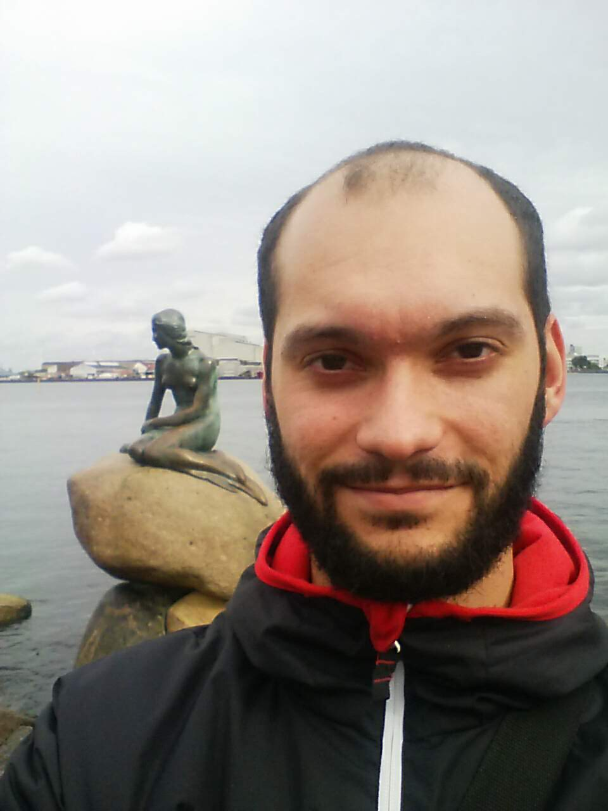

<marc.legeay@cpr.ku.dk>

## Short presentation

I joined Lars Juhl Jensen's group as a postdoc in September 2018. The group works with biological networks. I work on label propagation in networks so that we can associate a function to non-annoted proteins. I also develop a Cytoscape App in order to deals with site-specific data, time-series data, etc.

## Brief CV

- *09/2018--present*: Postdoctoral researcher at [Novo Nordisk Foundation Center for Protein Research](http://www.cpr.ku.dk/), University of Copenhagen, Denmark.  
- *09/2016--08/2018*: Research and Teaching Assistant at [University of Angers](http://www.univ-angers.fr/en/index.html), France.  
- *10/2013--08/2016*: PhD Student in Computer Sciences at [University of Angers](http://www.univ-angers.fr/en/index.html), France.

Full curriculum vitae as `.pdf` is available upon request.

## Other places to find me

- [Google Scholar](https://scholar.google.com/citations?user=I_nVyKAAAAAJ&hl=en)
- [DBLP](https://dblp.uni-trier.de/pers/hd/l/Legeay:Marc)
- [LinkedIn](https://www.linkedin.com/in/marc-legeay-07324969)
- [Staff website at University of Copenhagen](https://www.cpr.ku.dk/staff/?pure=en/persons/636426)
