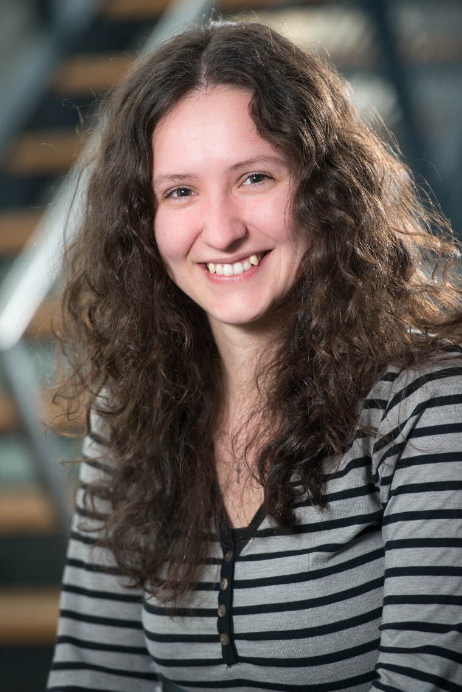

<nadezhda.doncheva@cpr.ku.dk>

## Experience

- 05/2016--present: PostDoc researcher at the [NNF Center for Protein Research](http://www.cpr.ku.dk/) and at the [Center for non-coding RNA in Technology and Health](https://rth.dk/) at the [University of Copenhagen](http://www.ku.dk/), Denmark
- 01/2010--05/2016: Research scientist in the [Department for Computational Biology and Applied Algorithmics](http://medbioinf.mpi-inf.mpg.de/) at the Max Planck Institute for Informatics, Germany 
- 03/2013--05/2013: Research scientist in the [Resource on Biocomputing, Visualization, and Informatics](http://www.rbvi.ucsf.edu/) at the University of California, San Francisco, USA

## Education

- 06/2016: PhD (Dr. rer. nat), Max Planck Institute for Informatics and Saarland University, Germany
- 11/2009: Masters (M. Sc.) in Bioinformatics, Saarland University, Germany
- 10/2007: Bachelor (B.S.) in Computational Molecular Biology, Saarland University, Germany 
- 05/2004: German high school diploma, German Language School "Prof. Konstantin Galabov", Bulgaria

## Other profiles

[LinkedIn](https://www.linkedin.com/in/nadezhda-t-doncheva/)
[Google Scholar](scholar.google.com/citations?user=TExtlUgAAAAJ&hl=en)
[University of Copenhagen](http://www.cpr.ku.dk/staff/cnb/?pure=en/persons/557793)
