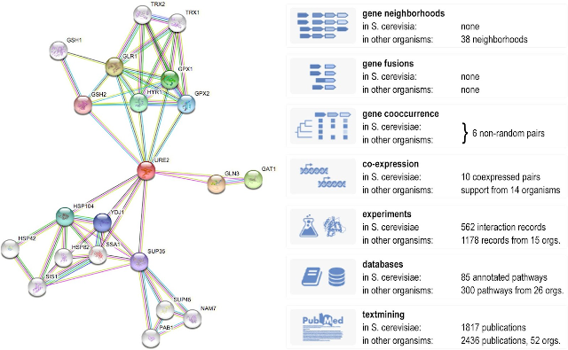
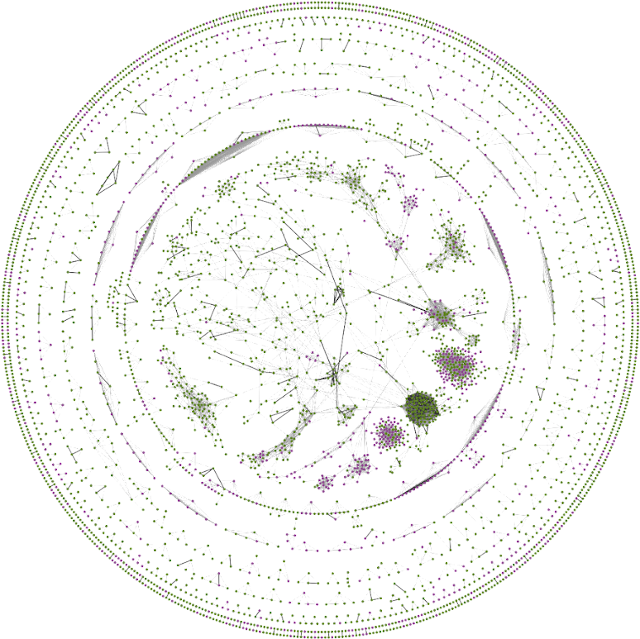
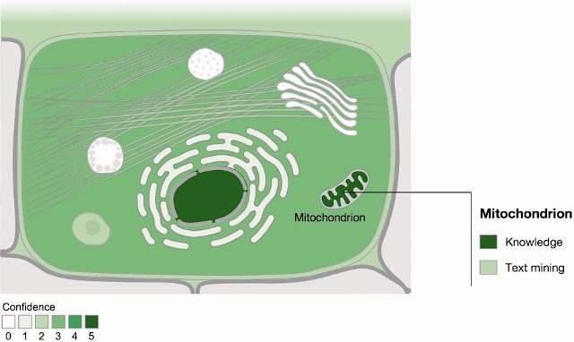
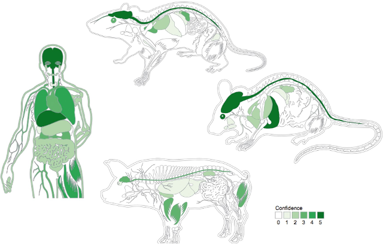

The core activity of JensenLab is to use network biology to help understand the inner workings of cells. We have done this primarily by creating database resources, which we make freely available under open licenses for computational and wet-lab researchers around the world to use.

## The STRING database

[STRING](https://string-db.org/) is a database of known and predicted protein interactions, which has existed for over 20 years, has more than 30,000 unique users per week. It is recognized by both ELIXIR and the Global Biodata Coalition as a core data resource, which is of fundamental importance to the wider life-science community. The database is developed primarily through a collaboration of three European bioinformatics research groups, namely the group of Christian von Mering at the University of Zurich, the group of Peer Bork at EMBL, and my own group. The STRING database has seen tremendous growth, increasing from 1,133 to 14,094 organisms, from 5.2 million to 67.6 million proteins, and from 332 million to 20 billion interactions (Franceschini et al., 2011; Szklarczyk et al., 2013, 2015, 2017, 2019, 2021, 2023).

  
*An example STRING network and overview of the many evidence types that contribute to it (Szklarczyk et al., 2019).*

The functional associations come from many types of evidence, including genomics context, gene coexpression, experimental interaction data, manually curated databases, automatic text mining, and orthology-based transfer of the aforementioned evidence types. Regardless of the type of evidence, all associations are scored in a probabilistic fashion, which allows them to be directly compared and integrated. Over the years all of these evidence channels have improved; genomic context due to more organisms, gene coexpression and experiments due to growing data repositories, and text mining due to general growth of the literature and increasing access to full-text articles.

STRING has changed both quantitatively, integrating ever more data, and qualitatively, adding new computational methods and new functionality. I have already covered how advances in deep learning have led to changes in the text-mining pipeline that provides evidence to STRING. However, the biggest change in recent time came with STRING v11.5, which for the first time allowed users to choose if they wanted the traditional functional association network or a physical subnetwork, consisting only of physical / cocomplex interactions (Szklarczyk et al., 2021). This was more work than it may look like at the surface, since it involved finding a good gold standard of protein complexes for scoring, separating the interactions from experimental repositories into physical and non-physical evidence, and making new scoring schemes for both the experimental data and the deep learning-based text mining. It was worth it, though, since some jobs call for a functional association network and others for a physical interaction network.

## Association prediction

Some of the improvements to the STRING network come in the form of new computational tools for prediction of functional associations. We have developed two such methods, which both rely heavily on dimensionality reduction techniques. A major strength of such methods is that they are based purely on systematic omics data (genomics, transcriptomics, and proteomics), which allows them to also make predictions for understudied proteins.

The first is SVD-Phy, the method providing the gene cooccurrence evidence (Franceschini et al., 2016). The method is remarkably simple: it takes a best-hit matrix for a genome as input, uses truncated singular value decomposition to reduce redundancy, and finally calculates Pearson correlation coefficients to infer functional associations. Despite its simplicity, it outperformed other published methods by a wide margin in our benchmark.

  
*FAVA network created through reanalysis of Human Protein Atlas single-cell RNA-seq data and PRIDE proteomics data (Koutroulli et al., 2023).*

[FAVA](https://github.com/mikelkou/fava) is a method for inferring functional associations from single-cell RNA-seq and proteomics atlases (Koutrouli et al., 2023). The method is similar to SVD-Phy in the sense that it starts from profiles, applies dimensionality reduction to reduce redundancy, and calculates Pearson correlation coefficients between the resulting latent representations. However, FAVA differs methodologically from SVD-Phy by using variational autoencoders for the dimensionality reduction, which turned out to be critical for making the method work on omics data rather than phylogenetic profiles. FAVA will be part of the upcoming version of STRING, where it will replace most of the existing coexpression channel.

## Related network databases

In addition to STRING itself and the computational methods that feed into it, the group has contributed to the development of a number of databases and tools that can be seen as part of STRING, extensions of STRING, or resources that build upon STRING.
The RAIN database is one such resource, which we developed in collaboration with the group of Jan Gorodkin to extend STRING with ncRNAs (Junge et al., 2017). The resource includes both protein–RNA and RNA-RNA interactions, with the evidence coming from manually curation,  databases of high-throughput experiments such as CLIP-seq, and computational predictions of miRNA targets. RAIN makes use of the so-called payload mechanism of STRING to allow all of this information to be shown within the web interface of STRING.

The [STITCH](http://stitch-db.org/) database is similar to RAIN in the sense that it extends the STRING with another type of molecular entities, namely drugs, metabolites, and other small-molecule compounds (Kuhn et al., 2010, 2012, 2014; Szklarczyk et al., 2016). Like STRING and RAIN, it integrates many types and sources of evidence for interactions, in this case between chemicals and proteins. Rather than using the STRING payload mechanism, STITCH is an entirely separate database with its own web interface, but with all its interactions between proteins being imported from STRING.

[Viruses.STRING](http://viruses.string-db.org/) was our first venture into interspecies interactions, starting from STRING and extending it with viral proteins, interactions between them, and interactions with host proteins (Cook et al., 2018). This was done in a manner similar to the STITCH database, but required considerable reworking of the user interface to support querying for proteins for a virus and its host, rather than only proteins from a single organism. Separate from this work, I was involved in another virus–host network resource, namely the Neo4COVID19 database that is built in part from the interaction data in STRING COVID-19 (Zahoránszky-Kőhalmi et al., 2022).

Our next project on interspecies interactions, [OrthoHPI](https://orthohpi.jensenlab.org/), instead focused on protein interactions between eukaryotic parasites, responsible for many neglected tropical diseases, and their human host (Cuesta Astroz et al., 2019). Together with collaborators in Brazil, we developed a method that combined intraspecies protein interactions from STRING with orthology-based transfer and filtering for protein localization, both in terms of subcellular localization and tissue expression, from the databases described in the next sections. This allowed us to predict interspecies interactions, which we made available as a web resource, and to compare the networks across parasites and thereby identify common mechanisms.

## Orthology detection

The [eggNOG](http://eggnog.embl.de/) database of orthology relations is a resource that was spun out from STRING (Muller et al., 2010; Powell et al., 2012, 2014; Huerta-Cepas et al., 2016, 2019; Hernández-Plaza et al., 2023). Since STRING relies on orthology information for doing evidence transfer across species, it has from the very beginning contained data on orthology relations. When we realized that a subset of STRING users came for this information rather than the interaction networks, we decided to create a separate database resource, eggNOG, with a web interface designed specifically to serve these users. The resulting eggNOG database has become quite successful in this competitive field, and it is among the best methods in the Quest for Orthologs benchmark (Altenhoff et al., 2016). The team behind eggNOG also developed a tool, eggNOG-mapper, which allows users to quickly and easily map newly sequenced genomes to the genomes in eggNOG (Huerta-Cepas et al., 2017).

## Protein localization

The group has developed several resources that, while not part of STRING or built upon it, are designed to be part of the same ecosystem. Two of these relate to protein localization, namely [COMPARTMENTS](https://compartments.jensenlab.org/) (Binder et al., 2014) and [TISSUES](https://tissues.jensenlab.org/) (Santos et al., 2015; Palasca et al., 2018). Both these resources map information to STRING protein identifiers to make integration of protein networks and protein localization easy. They further assign confidence scores to all available evidence, thereby allowing direct comparison across evidence types.

  
*Example of a cell schematic from the COMPARTMENTS resource (Binder et al., 2014).*

The [COMPARTMENTS](https://compartments.jensenlab.org/) database was the first in a series of such resources. It brought together subcellular localization information from manually curated databases, antibody-based data from the Human Protein Atlas, automatic text mining of biomedical abstracts, and sequence-based predictions (Binder et al., 2014). All evidence is mapped to Gene Ontology cellular component terms. The COMPARTMENTS web resource allows users to access comprehensive data on protein subcellular localization for human proteins and proteins from six major model organisms (https://compartments.jensenlab.org/). It features a graphic representation of protein localization in the form of a cell schematic, which was at one point reused with permission by UniProtKB, and the schematic with data from COMPARTMENTS is shown in the GeneCards database.

  
*Examples of body schematics for human, mouse, rat, and pig from the TISSUES resource (Palasca et al., 2018.)*

The [TISSUES](https://tissues.jensenlab.org/) database is conceptually very similar to COMPARTMENTS, mapping proteins to anatomical rather than cellular locations. However, the evidence landscape is vastly different, with large expression atlases being the major source of evidence, manually curated annotations and automatic literature mining both being much less reliable, and sequence-based predictions not even existing (Santos et al., 2015; Palasca et al., 2018). The web resource covers human, mouse, rat, and pig due to the availability of large-scale expression atlases, and it provides an overview visualization in the form of body schematics of the respective organisms, similar to how COMPARTMENTS has a schematics of cells (https://tissues.jensenlab.org/). TISSUES also formed the basis for a pathway-centric analysis of tissue expression, exploring the possibilities and limitations of animal models (Doncheva et al, 2021).

## Disease–gene associations

Interaction networks are often used for visualizing our current understanding of diseases and to expand upon by suggesting new candidate genes. For this reason, we created the [DISEASES](https://diseases.jensenlab.org/) database of disease–gene associations, which was designed for easy integration with STRING (Pletscher-Frankild et al., 2015; Grissa et al., 2022). Like the TISSUES database, DISEASES combines evidence from manually curated databases, experimental evidence, and associations automatically text mined from the biomedical literature. However, text mining works particularly well for gene–disease associations, and this is thus by far the biggest source of evidence in this database. The text-mined gene–disease associations from DISEASES are also made available via the GeneCards and MalaCards databases.

The experimental evidence in DISEASES comes from GWAS data, which were originally imported from the DistiLD database (Pallejà et al., 2012). DistiLD has since been replaced by the TIGA resource, which we developed together with our collaborators on the IDG project (Yang et al., 2021). DistiLD and TIGA both import SNP–trait associations from individual studies in the NHGRI-EBI GWAS Catalog and calculates scores for gene–trait associations by integrating evidence across SNPs and studies.
A very early version of DISEASES formed the basis for a tool, mirPD, developed in collaboration with the group of Jan Gorodkin (Mørk et al., 2014). The tool combines miRNA-target information from manual curation and from two existing prediction tools with the disease-associations for protein-coding genes from DISEASES. This allows guild-by-association to be used to associate miRNAs with diseases via protein-coding genes.

## Disease networks

Disease networks do not need to involve genes at all; for example, one can derive correlation networks for diseases from electronic registries. I collaborated with the Brunak group to do the first large-scale study, using data for the whole population of Denmark to systematically identify temporal disease correlations and condense these into longer disease trajectories (Jensen et al., 2014). We subsequently worked with clinicians at Odense University Hospital to use this method to study alcoholic liver disease as part of the GALAXY consortium (Grissa et al., 2020).

## Knowledge graphs

A knowledge graph is a heterogeneous network with multiple types of nodes and edges; for example, a knowledge graph could be a network connecting small molecules, genes/proteins, cellular components, tissues, and diseases. It is thus easy to see how the database resources developed in my group could be combined to produce a knowledge graph; in fact, many of them were used in the creation of the [Hetionet](https://het.io/) knowledge graph.

The databases developed within the group were therefore a solid foundation for the work on the [Clinical Knowledge Graph (CKG)](https://github.com/MannLabs/CKG) in the Mann group (Santos et al., 2022). This collaboration resulted in a powerful platform that supports analysis and interpretation of proteomics data, especially for clinical samples, by combining an extensive knowledge graph with statistical and machine-learning methods.

## References

Binder JX\*, Pletscher-Frankild S\*, Tsafou K, Stolte C, O’Donoghue SI, Schneider R and Jensen LJ (2014). COMPARTMENTS: unification and visualization of protein subcellular localization evidence. *Database*, **2014**:bau012.  
[Abstract](https://pubmed.ncbi.nlm.nih.gov/24573882) [Full text](https://doi.org/10.1093/database/bau012) [WWW](https://compartments.jensenlab.org) 

Cook HV, Doncheva NT, Szklarczyk D, von Mering C and Jensen LJ (2018). Viruses.STRING: A virus–host protein–protein interaction database. *Viruses*, **10**:E519.  
[Abstract](https://pubmed.ncbi.nlm.nih.gov/30249048) [Full text](https://doi.org/10.3390/v10100519) [WWW](http://viruses.string-db.org/) 

Cuesta-Astroz Y\*, Santos A\*, Oliveira G and Jensen LJ (2019). An integrative method to unravel the host-parasite interactome: An orthology-based approach. *Frontiers in Immunology*, **10**:212.  
[Abstract](https://pubmed.ncbi.nlm.nih.gov/30815000) [Full text](https://doi.org/10.3389/fimmu.2019.00212) [WWW](https://orthohpi.jensenlab.org/) 

Franceschini A, Szklarczyk D, Pletscher-Frankild S, Kuhn M, Simonovic M, Roth A, Lin J, Minguez P, Bork P\*, von Mering C\* and Jensen LJ\* (2013). STRING v9.1: protein-protein interaction networks, with increased coverage and integration. *Nucleic Acids Research*, **41**:D808-D815.  
[Abstract](https://pubmed.ncbi.nlm.nih.gov/23203871) [Full text](https://doi.org/10.1093/nar/gks1094) [WWW](https://string-db.org) 

Grissa D, Rasmussen DN, Krag A, Brunak S and Jensen LJ (2020). Alcoholic liver disease: A registry view on comorbidities and disease prediction. *PLOS Computational Biology*, **16**:e1008244.  
[Full text](https://doi.org/10.1371/journal.pcbi.1008244) 

Grissa D, Junge A, Oprea TI and Jensen LJ (2022). DISEASES 2.0: a weekly updated database of disease–gene associations from text mining and data integration. *Database*, **2022**:baac019.  
[PubMed](https://pubmed.ncbi.nlm.nih.gov/35348648/) [Full text](https://doi.org/10.1093/database/baac019) [Preprint](https://doi.org/10.1101/2021.12.07.471296) [WWW](https://diseases.jensenlab.org) 

Hernández-Plaza A, Szklarczyk D, Botas J, Cantalapiedra CP, Giner-Lamia J, Mende DR, Kirsch R, Rattei T, Letunic I, Jensen LJ, Bork P, von Mering C and Jaime Huerta-Cepas J (2023). eggNOG 6.0: enabling comparative genomics across 12535 organisms. *Nucleic Acids Research*, **51**:D389-D394.  
[Abstract](https://pubmed.ncbi.nlm.nih.gov/36399505/) [Full text](https://doi.org/10.1093/nar/gkac1022) [WWW](http://eggnog6.embl.de/) 

Huerta-Cepas J, Szklarczyk D, Forslund K, H. Cook H, Heller D, Walter MC, Rattei T, Mende DR, Sunagawa S, Kuhn M, Jensen LJ, von Mering C and Bork P (2016). eggNOG 4.5: a hierarchical orthology framework with improved functional annotations for eukaryotic, prokaryotic and viral sequences. *Nucleic Acids Research*, **44**:D286-D293.  
[Abstract](https://pubmed.ncbi.nlm.nih.gov/26582926) [Full text](https://doi.org/10.1093/nar/gkv1248) [WWW](http://eggnog.embl.de/) 

Huerta-Cepas J, Forslund K, Szklarczyk D, Jensen LJ, von Mering C and Bork P (2017). Fast genome-wide functional annotation through orthology assignment by eggNOG-mapper. *Molecular Biology and Evolution*, **34**:2115-2122.  
[Abstract](https://pubmed.ncbi.nlm.nih.gov/28460117) [Full text](https://doi.org/10.1093/molbev/msx148) [WWW](http://eggnog-mapper.embl.de) 

Huerta-Cepas J, Szklarczyk D, Heller D, Hernández-Plaza A, Forslund SK, Cook H, Mende DR, Letunic I, Rattei T, Jensen LJ, von Mering C and Bork P (2019). eggNOG 5.0: a hierarchical, functionally and phylogenetically annotated orthology resource based on 5090 organisms and 2502 viruses. *Nucleic Acids Research*, **47**:D309-D314.  
[Abstract](https://pubmed.ncbi.nlm.nih.gov/30418610) [Full text](https://doi.org/10.1093/nar/gky1085) [WWW](http://eggnog.embl.de/) 

Jensen AB, Moseley PL, Oprea T, Ellesøe SG, Eriksson R, Schmock H, Jensen PB, Jensen LJ\* and Brunak S\* (2014). Temporal disease trajectories condensed from population-wide registry data covering 6.2 million patients. *Nature Communications*, **5**:4022.  
[Abstract](https://pubmed.ncbi.nlm.nih.gov/24959948) [Full text](https://doi.org/10.1038/ncomms5022) 

Kuhn M, Szklarczyk D, Franceschini A, Campillos M, von Mering C, Jensen LJ, Beyer A and Bork P (2010). STITCH 2: an interaction network database for small molecules and proteins. *Nucleic Acids Research*, **38**:D552-D566.  
[Abstract](https://pubmed.ncbi.nlm.nih.gov/19897548) [Full text](https://doi.org/10.1093/nar/gkp937) [WWW](https://stitch-db.org) 

Kuhn M, Szklarczyk D, Franceschini A, von Mering C, Jensen LJ and Bork P (2012). STITCH 3: zooming in on protein-chemical interactions. *Nucleic Acids Research*, **40**:D876-D880.  
[Abstract](https://pubmed.ncbi.nlm.nih.gov/22075997) [Full text](https://doi.org/10.1093/nar/gkr1011) [WWW](https://stitch-db.org) 

Kuhn M\*, Szklarczyk D, Pletscher-Frankild S, Blicher TH, von Mering C, Jensen LJ\* and Bork P\* (2014). STITCH 4: integration of protein-chemical interactions with user data. *Nucleic Acids Research*, **42**:D401-D407.  
[Abstract](https://pubmed.ncbi.nlm.nih.gov/24293645) [Full text](https://doi.org/10.1093/nar/gkt1207) [WWW](https://stitch-db.org) 

Muller J, Szklarczyk D, Julien P, Letunic I, Roth A, Kuhn M, Powell S, von Mering C, Doerks T, Jensen LJ and Bork P (2010). eggNOG v2.0: extending the evolutionary genealogy of genes with enhanced Non-supervised Orthologous Groups, species and functional annotations. *Nucleic Acids Research*, **38**:D190-D195.  
[Abstract](https://pubmed.ncbi.nlm.nih.gov/19900971) [Full text](https://doi.org/10.1093/nar/gkp951) [WWW](http://eggnog.embl.de) 

Mørk S, Pletscher-Frankild S, Palleja A, Gorodkin J\* and Jensen LJ\* (2014). Protein-driven inference of miRNA-disease associations. *Bioinformatics*, **30**:392-937.  
[Abstract](https://pubmed.ncbi.nlm.nih.gov/24273243) [Full text](https://doi.org/10.1093/bioinformatics/btt677) [WWW](https://mirpd.jensenlab.org) 

Palasca O, Santos A, Stolte C, Gorodkin J\* and Jensen LJ\* (2018). TISSUES 2.0: an integrative web resource on mammalian tissue expression. *Database*, **2018**:bay003.  
[Abstract](https://pubmed.ncbi.nlm.nih.gov/29617745) [Full text](https://doi.org/10.1093/database/bay003) 

Pallejà A, Horn H, Eliasson S and Jensen LJ (2012). DistiLD Database: diseases and traits in linkage disequilibrium blocks. *Nucleic Acids Research*, **40**:D1036-D1040.  
[Abstract](https://pubmed.ncbi.nlm.nih.gov/22058129) [Full text](https://doi.org/10.1093/nar/gkr899) [WWW](http://distild.jensenlab.org) 

Pletscher-Frankild S, Pallejà A, Tsafou K, Binder JX and Jensen LJ (2015). DISEASES: Text mining and data integration of disease–gene associations. *Methods*, **74**:83-89.  
[Abstract](https://pubmed.ncbi.nlm.nih.gov/25484339) [Full text](https://doi.org/10.1016/j.ymeth.2014.11.020) [WWW](https://diseases.jensenlab.org) 

Powell S, Szklarczyk D, Trachana K, Roth A, Kuhn M, Muller J, Arnold R, Rattei T, Letunic I, Doerks T, Jensen LJ\*, von Mering C\* and Bork P\* (2012). eggNOG v3.0: orthologous groups covering 1133 organisms at 41 different taxonomic ranges. *Nucleic Acids Research*, **40**:D284-D289.  
[Abstract](https://pubmed.ncbi.nlm.nih.gov/22096231) [Full text](https://doi.org/10.1093/nar/gkr1060) [WWW](http://eggnog.embl.de) 

Powell S, Forslund K, Szklarczyk D, Trachana K, Roth A, Huerta-Cepas J, Gabaldón T, Rattei T, Creevey C, Kuhn M, Jensen LJ\*, von Mering C\* and Bork P\* (2014). eggNOG v4.0: nested orthology inference across 3686 organisms. *Nucleic Acids Research*, **42**:D231-D239.  
[Abstract](https://pubmed.ncbi.nlm.nih.gov/24297252) [Full text](https://doi.org/10.1093/nar/gkt1253) [WWW](http://eggnog.embl.de) 

Santos A, Tsafou K, Stolte C, Pletscher-Frankild S, O'Donoghue SI and Jensen LJ (2015). Comprehensive comparison of large-scale tissue expression datasets. *PeerJ*, **3**:e1054.  
[Abstract](https://pubmed.ncbi.nlm.nih.gov/26157623) [Full text](https://doi.org/10.7717/peerj.1054) [WWW](https://tissues.jensenlab.org) 

Santos A, Colaço AR, Nielsen AB, Niu L, Strauss M, Geyer PE, Coscia F, Albrechtsen NJW, Mundt F, Jensen LJ and Mann M (2022). Clinical knowledge graph integrates proteomics data into clinical decision-making. *Nature Biotechnology*, **40**:692-702.  
[Abstract](https://pubmed.ncbi.nlm.nih.gov/35102292/) [Full text](https://doi.org/10.1038/s41587-021-01145-6) [Preprint](https://doi.org/10.1101/2020.05.09.084897) 

Szklarczyk D, Franceschini A, Kuhn M, Simonovic M, Roth A, Minguez P, Doerks T, Stark M, Muller J, Bork P, Jensen LJ and von Mering C (2011). The STRING database in 2011: functional interaction networks of proteins, globally integrated and scored. *Nucleic Acids Research*, **39**:D561-D568.  
[Abstract](https://pubmed.ncbi.nlm.nih.gov/21045058) [Full text](https://doi.org/10.1093/nar/gkq973) [WWW](https://string-db.org) 

Szklarczyk D, Franceschini A, Wyder S, Forslund K, Heller D, Huerte-Cepas J, Simonovic M, Roth A, Santos A, Tsafou KP, Kuhn M, Bork P\*, Jensen LJ\* and von Mering C\* (2015). STRING v10: protein–protein interaction networks, integrated over the tree of life. *Nucleic Acids Research*, **43**:D447-D452.  
[Abstract](https://pubmed.ncbi.nlm.nih.gov/25352553) [Full text](https://doi.org/10.1093/nar/gku1003) [WWW](https://string-db.org) 

Szklarczyk D, Santos A, von Mering C, Jensen LJ, Bork P and Kuhn M (2016). STITCH 5: augmenting protein-chemical interaction networks with tissue and affinity data. *Nucleic Acids Research*, **44**:D380-D384.  
[Abstract](https://pubmed.ncbi.nlm.nih.gov/26590256) [Full text](https://doi.org/10.1093/nar/gkv1277) [WWW](https://stitch-db.org/) 

Szklarczyk D, Morris JH, Cook H, Kuhn M, Wyder S, Simonovic M, Santos A, Doncheva NT, Roth A, Bork P\*, Jensen LJ\* and von Mering C\* (2017). The STRING database in 2017: quality-controlled protein-protein association. *Nucleic Acids Research*, **45**:D362-D368.  
[Abstract](https://pubmed.ncbi.nlm.nih.gov/27924014) [Full text](https://doi.org/10.1093/nar/gkw937) [WWW](https://string-db.org) 

Szklarczyk D, Gable AL, Lyon D, Junge A, Wyder S, Huerta-Cepas J, Simonovic M, Doncheva NT, Morris JH, Bork P\*, Jensen LJ\* and von Mering C\* (2019). STRING v11: protein–protein association networks with increased coverage, supporting functional discovery in genome-wide experimental datasets. *Nucleic Acids Research*, **47**:D607-D613.  
[Abstract](https://pubmed.ncbi.nlm.nih.gov/30476243) [Full text](https://doi.org/10.1093/nar/gky1131) [WWW](https://string-db.org) 

Szklarczyk D\*, Gable AL\*, Nastou KC, Lyon D, Kirsch R, Pyysalo S, Doncheva NT, Legeay M, Fang T, Bork P\*, Jensen LJ\* and von Mering C\* (2021). The STRING database in 2021: customizable protein-protein networks, and functional characterization of user-uploaded gene/measurement sets. *Nucleic Acids Research*, **49**:D605–D612.  
[Abstract](https://pubmed.ncbi.nlm.nih.gov/33237311) [Full text](https://doi.org/10.1093/nar/gkaa1074) [WWW](https://string-db.org) 

Szklarczyk D, Kirsch R, Koutrouli M, Nastou K, Mehryary F, Hachilif R, Gable AL, Fang T, Doncheva NT, Pyysalo S, Bork P\*, Jensen LJ\* and Christian von Mering C\* (2023). The STRING database in 2023: protein-protein association networks and functional enrichment analyses for any sequenced genome of interest. *Nucleic Acids Research*, **51**:D638-D646  
[Abstract](https://pubmed.ncbi.nlm.nih.gov/36370105/) [Full text](https://doi.org/10.1093/nar/gkac1000) [WWW](https://string-db.org/) 

Yang JJ, Grissa D, Lambert CG, Bologa CG, Mathias SL, Waller A, Wild DJ, Jensen LJ and Oprea TI (2021). TIGA: Target illumination GWAS analytics. *Bioinformatics*, **21**:3865-3873.  
[Abstract](https://pubmed.ncbi.nlm.nih.gov/34086846/) [Full text](https://doi.org/10.1093/bioinformatics/btab427) [Preprint](https://doi.org/10.1101/2020.11.11.378596) [WWW](https://unmtid-shinyapps.net/tiga/) 

\* Joint first and/or joint corresponding authors.  

