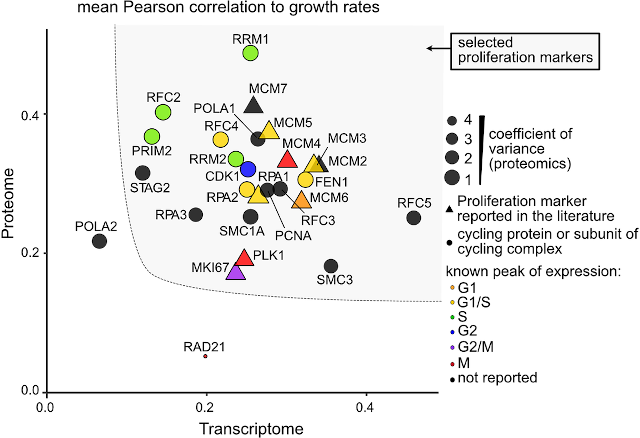

The third broad topic that my group works on is analysis of omics data. Our work spans the full spectrum of tool development, reanalysis of already published omics data, and collaborations with wet-lab groups on analysis of unpublished data. The latter has led to numerous joint papers on analysis of mass-spectrometry data with all of the proteomics groups at CPR, most of which focused on various post-translational modifications (PTMs). Working closely with wet-lab groups is to bioinformatics tool development, using your own tools on a wide range of real-world datasets and scientific problems is, in my opinion, the best way to find ways to improve them.

## Tool development

Over the years, the group has worked on several tools for PTM analysis. In collaboration with the Linding Lab, we developed two tools to assign kinases to phosphorylation sites, namely the NetPhorest kinase motif atlas (Miller et al., 2008) and the KinomeXplorer resource that combines the motifs with functional associations from STRING (Horn et al., 2014a). We also published a related tool for other post-translational modifications called [DoReMi](http://doremi.jensenlab.org/), which allows users to provide a regular expression for their sequence motif of interest and obtain a list of matches that is prioritized based on the protein network (Horn et al., 2014b).

We then proceeded to work on gene set enrichment analysis, collaborating with the Choudhary group at CPR to develop the [aGOtool](https://agotool.org/) method (Schölz et al., 2015a). This tool was specifically designed to address the problem of abundance bias in proteomics data adversely affecting the results of enrichment analysis. However, in the end the code developed in this project ended up completely replacing the old enrichment analysis backend of the STRING database.

Finally, the group has worked on more low-level analysis of mass-spectrometry data, developing one of the early methods for prediction of fragmentation spectra (Kirik et al., 2019). Recently, we worked with the Rasmussen group at CPR on using deep learning for imputation of missing values in mass spectrometry-based proteomics (Webel et al., 2023).

## Quantitative omics

In addition to tools, we have developed another resource for transcriptomics and proteomics researchers, namely a human cell proliferation signature (Locard-Paulet et al., 2022). When performing perturbation experiments, cell cultures will be exposed to treatments that in addition to the intended effect may alter (typically lower) the growth rate of the cells. The slower a cell grows, the more time it will spend in G1-phase and G2-phase whereas the lengths of S-phase and M-phase are unchanged. In an asynchronous cell culture a smaller proportion of cells will thus be in the latter phases at any given point in time, and any transcripts or proteins specific to these phases will thus unavoidably seemingly be downregulated. To address this problem, we reanalyzed several published transcriptomics and proteomics datasets to define a panel of cell proliferation markers that allows us estimate changes in proliferation rate and to identify a larger set of signature genes correlated with changes in proliferation rate. This allows researchers to easily estimate if proliferation rate is likely to have changed in their experiments and to mark which of the statistically significantly regulated transcripts/proteins may be due to changes in proliferation rate rather than due to the intended perturbation.

  
*A set of genes was selected based on transcriptomics and proteomics data and used to define a pseudo-proliferation index (Locard-Paulet et al., 2022).*

We often collaborate with wet-lab scientists on analysis of their unpublished transcriptomics or quantitative proteomics data. These projects span a wide range of biological questions as well as organisms. For example, we have worked on transcriptome analysis of temporal lobe epilepsy using clinical samples (Kjær et al., 2019, 2023), proteome comparison of human hearts with those of model organisms (Linscheid et al., 2021), light-induced asymmetries of retinal gene expression in chick embryos (Versace et al., 2022), multi-omics analysis of *Acanthamoeba castellanii encystment* (Bernard et al., 2022), as well as cross-species transcriptomics profiling of multiple myeloma-induced bone pain (Diaz-delCastillo et al., 2023) and ulcerative colitis (Yarani et al, 2023).

## PTM analysis

Protein phosphorylation is the most studied PTM, especially from a proteomics perspective, and analysis of phosphoproteomics data is thus an important topic for us. For this reason, we carried out a comparative benchmark of 22 different computational pipelines, evaluating their ability to correctly identify both the peptides and the localizations of phosphorylation sites (Locard-Paulet et al., 2020). We also collaborated closely with the Olsen group at CPR on a systematic study of phospho-binding proteins, developing a specialized web tool for analyzing the type of pulldown data produced (Lundby et al., 2019). Most other collaborations with the Olsen group focused on analysis of phosphoproteomics data for various types of cancer to identify key regulators in these. Examples include studies of kinase activity in angiotensin receptor signaling (Bøgebo et al., 2014), the role of Cbl-b in neuroblastoma cell differentiation (Emdal et al., 2015), CDK7 in epithelial ovarian cancer (Francavilla et al., 2017), and SHP2 in acute myeloid leukemia (Pfeiffer et al., 2022). These studies have made heavy use of the protein network resources developed within the group. We also recently co-authored a review on profiling of kinase signaling networks (Franciosa et al., 2023).

Another prominent PTM is lysine acetylation, which has been a focus of the Choudhary group at CPR. We have collaborated with them to analyze proteomics data on lysine acetylation (Schölz et al., 2015b) as well as deacetylation (Weinert et al., 2017). Lastly, we have worked with the Nielsen group on analysis of several different PTMs, namely arginine methylation (Sylvestersen et al., 2014), SUMOylation (Hendriks et al., 2017, 2018), and ADP-ribosylation (Larsen et al., 2018).

## Other applications

Mass spectrometry-based proteomics is a versatile technology, and while the focus at CPR is on PTMs, we have worked with the proteomics groups on several other projects. This includes immunopeptidomics with the Mann group (Bassani-Sternberg et al., 2015), identification of RNA-binding proteins with the Nielsen group (Mullari et al., 2017), and paleoproteomics with the Cappellini group from the Globe Institute and the Olsen group (Jersie-Christensen et al., 2018; Mackie et al., 2018).

## References

Bassani-Sternberg M, Pletscher-Frankild S, Jensen LJ and Mann M (2015). Mass spectrometry of HLA-I peptidomes reveals strong effects of protein abundance and turnover on antigen presentation. *Molecular and Cellular Proteomics*, **14**:658-673.  
[Abstract](https://pubmed.ncbi.nlm.nih.gov/25576301) [Full text](https://doi.org/10.1074/mcp.M114.042812) 

Bernard C\*, Locard-Paulet M\*, Noël C\*, Duchateau M, Gianetto QG, Moumen B, Rattei T, Hechard Y, Jensen LJ, Matondo M and Samba-Louaka A (2022). A time-resolved multi-omics atlas of Acanthamoeba castellanii encystment. *Nature Communications*, **13**:4104.  
[Abstract](https://pubmed.ncbi.nlm.nih.gov/35835784/) [Full text](https://doi.org/10.1038/s41467-022-31832-0) 

Bøgebo R, Horn H, Olsen JV, Gammeltoft S, Jensen LJ, Hansen JL and Christensen GL (2014). Predicting kinase activity in Angiotensin receptor phosphoproteomes based on sequence-motifs and interactions. *PLOS ONE*, **9**:e94672.  
[Abstract](https://pubmed.ncbi.nlm.nih.gov/24722691) [Full text](https://doi.org/10.1371/journal.pone.0094672) 

Diaz-delCastillo M, Palasca O, Nemler TT, Thygesen DM, Chávez-Saldaña NA, Vázquez-Mora JA, Ponce Gomez LY, Jensen LJ, Evans H, Andrews RE, Mandal A, Neves D, Mehlen P, Caruso JP, Dougherty PM, Price TJ, Chantry A, Lawson MA, Andersen TL, Jimenez-Andrade JM and Heegaard AM (2023). Metastatic infiltration of nervous tissue and periosteal nerve sprouting in multiple myeloma induced bone pain in mice and human. *Journal of Neuroscience*, **43**:5414-5430.  
[Abstract](https://pubmed.ncbi.nlm.nih.gov/37286351/) [Full text](https://doi.org/10.1523/JNEUROSCI.0404-23.2023) [Preprint](https://doi.org/10.1101/2022.12.29.522199) 

Emdal KB, Pedersen A-K, Bekker-Jensen DB, Tsafou KP, Horn H, Lindner S, Schulte JH, Eggert A, Jensen LJ, Francavilla C and Olsen JV (2015). Temporal proteomics of NGF-TrkA signaling identifies an inhibitory role for the E3 ligase Cbl-b in neuroblastoma cell differentiation. *Science Signaling*, **8**:ra40.  
[Abstract](https://pubmed.ncbi.nlm.nih.gov/25921289) [Full text](https://doi.org/10.1126/scisignal.2005769) 

Francavilla C, Lupia M, Tsafou K, Villa A, Kowalczyk K, Rakownikow Jersie-Christensen R, Bertalot G, Confalonieri S, Brunak S, Jensen LJ, Cavallaro U and Olsen JV (2017). Phosphoproteomics of primary cells reveals druggable kinase signatures in ovarian cancer. *Cell Reports*, **18**:3242-3256.  
[Abstract](https://pubmed.ncbi.nlm.nih.gov/28355574) [Full text](https://doi.org/10.1016/j.celrep.2017.03.015) 

Hendriks IA, Lyon D, Young C, Jensen LJ, Vertegaal AC and Nielsen ML (2017). Site-specific mapping of the human SUMO proteome reveals co-modification with phosphorylation. *Nature Structural & Molecular Biology*, **24**:325-335.  
[Abstract](https://pubmed.ncbi.nlm.nih.gov/28112733) [Full text](https://doi.org/10.1038/nsmb.3366) 

Hendriks IA, Lyon D, Su D, Skotte NH, Daniel JA, Jensen LJ and Nielsen ML (2018). Site-specific characterization of endogenous SUMOylation across species and organs. *Nature Communications*, **9**:2456.  
[Abstract](https://pubmed.ncbi.nlm.nih.gov/29942033) [Full text](https://doi.org/10.1038/s41467-018-04957-4) 

Horn H\*, Schoof EM\*, Kim J\*, Robin X, Miller ML, Diella F, Palma A, Cesareni G, Jensen LJ\* and Linding R\* (2014a). KinomeXplorer: an integrated platform for kinome biology studies. *Nature Methods*, **11**:603-604.  
[Abstract](https://pubmed.ncbi.nlm.nih.gov/24874572) [Full text](https://doi.org/10.1038/nmeth.2968) [WWW](http://kinomexplorer.info) 

Horn H, Haslam N and Jensen LJ (2014b). DoReMi: context-based prioritization of linear motif matches. *PeerJ*, **2**:e315.  
[Abstract](https://pubmed.ncbi.nlm.nih.gov/24711967) [Full text](https://doi.org/10.7717/peerj.315) 

Jersie-Christensen RR, Lanigan LT, Lyon D, Mackie M, Belstrøm D, Kelstrup C, Fotakis AK, Willerslev E, Lynnerup N, Jensen LJ, Cappellini E and Olsen JV (2018). Quantitative metaproteomics of medieval dental calculus reveals individual oral health status. *Nature Communications*, **9**:4744.  
[Abstract](https://pubmed.ncbi.nlm.nih.gov/30459334) [Full text](https://doi.org/10.1038/s41467-018-07148-3) 

Kirik U, Refsgaard JC and Jensen LJ (2019). Improving peptide-spectrum matching by fragmentation prediction using Hidden Markov Models. *Journal of Proteome Research*, **18**:2385-2396.  
[Abstract](https://pubmed.ncbi.nlm.nih.gov/31074280) [Full text](https://doi.org/10.1021/acs.jproteome.8b00499) [Preprint](https://doi.org/10.1101/358283) [Source code](https://github.com/ukirik/hmsms) 

Kjær C, Barzaghi G, Bak LK, Goetze JP, Yde CW, Woldbye D, Pinborg LH and Jensen LJ (2019). Transcriptome analysis in patients with temporal lobe epilepsy. *Brain*, **141**:e55.  
[Abstract](https://pubmed.ncbi.nlm.nih.gov/31504209) [Full text](https://doi.org/10.1093/brain/awz265) 

Kjær C, Palasca O, Barzaghi G, Bak LK, Durhuus RKJ, Jakobsen E, Pedersen L, Bartels ED, Woldbye DPD, Pinborg LH and Jensen LJ (2023). Differential Expression of the β3 Subunit of Voltage-Gated Ca2+ Channel in Mesial Temporal Lobe Epilepsy. *Molecular Neurobiology*.  
[Abstract](https://pubmed.ncbi.nlm.nih.gov/37341859/) [Full text](https://doi.org/10.1007/s12035-023-03426-4) 

Larsen SC, Sylvestersen KB, Mund A, Lyon D, Mullari M, Madsen MV, Daniel JA, Jensen LJ and Nielsen ML (2016). Proteome-wide analysis of arginine monomethylation reveals widespread occurrence in human cells. *Science Signaling*, **9**:rs9.  
[Abstract](https://pubmed.ncbi.nlm.nih.gov/27577262) [Full text](https://doi.org/10.1126/scisignal.aaf7329) 

Linscheid N, Santos A, Poulsen PC, Mills RW, Calloe K, Leurs U, Ye JZ, Stolte C, Thomsen MB, Bentzen BH, Lundegaard PR, Olesen MS, Jensen LJ, Olsen JV and Lundby A (2021). Quantitative proteome comparison of human hearts with those of model organisms. *PLOS Biology*, **19**:e3001144.  
[Abstract](https://pubmed.ncbi.nlm.nih.gov/33872299/) [Full text](https://doi.org/10.1371/journal.pbio.3001144) 

Locard-Paulet M, Bouyssié D, Froment C, Burlet-Schiltz O and Jensen LJ (2020). Comparing 22 Popular Phosphoproteomics Pipelines for Peptide Identification and Site Localization. *Journal of Proteome Research*, **19**:1338-1345.  
[Abstract](https://pubmed.ncbi.nlm.nih.gov/31975593) [Full text](https://doi.org/10.1021/acs.jproteome.9b00679) 

Locard-Paulet M, Palasca O and Jensen LJ (2022). Identifying the genes impacted by cell proliferation in proteomics and transcriptomics studies. *PLOS Computational Biology*, **18**:e1010604.  
[Abstract](https://pubmed.ncbi.nlm.nih.gov/36201535/) [Full text](https://doi.org/10.1371/journal.pcbi.1010604) 

Lundby A, Franciosa G, Emdal KB, Refsgaard JC, Gnosa SP, Bekker-Jensen DB, Secher A, Maurya SR, Paul I, Mendez BL, Kelstrup CD, Francavilla C, Kveiborg M, Montoya G, Jensen LJ and Olsen JV (2019). Oncogenic Mutations Rewire Signaling Pathways by Switching Protein Recruitment to Phosphotyrosine Sites. *Cell*, **179**:543-560.  
[Abstract](https://pubmed.ncbi.nlm.nih.gov/31585087) [Full text](https://doi.org/10.1016/j.cell.2019.09.008) 

Mackie M, Rüther P, Samodova D, Di Gianvincenzo F, Granzotto C, Lyon D, Peggie DA, Howard H, Harrison L, Jensen LJ, Olsen JV and Cappellini E (2018). Palaeoproteomic profiling of conservation layers on a 14th century Italian wall painting. *Angewandte Chemie International Edition*, **57**:7369-7374.  
[Abstract](https://pubmed.ncbi.nlm.nih.gov/29603563) [Full text](https://doi.org/10.1002/anie.201713020) 

Miller ML\*, Jensen LJ\*, Diella F, Jørgensen C, Tinti M, Li L, Hsiung M, Parker SA, Bordeaux J, Sicheritz-Ponten T, Olhovsky M, Pasculescu A, Alexander J, Knapp S, Blom N, Bork P, Li S, Cesareni G, Pawson T, Turk BE, Yaffe MB, Brunak S, Linding R (2008). Linear motif atlas for phosphorylation-dependent signaling. *Science Signaling*, **1**:ra2.  
[Abstract](https://pubmed.ncbi.nlm.nih.gov/18765831) [Full text](https://doi.org/10.1126/scisignal.1159433) [WWW](http://netphorest.info) 

Mullari M, Lyon D, Jensen LJ and Nielsen ML (2017). Specifying RNA-binding regions in proteins by peptide Cross-Linking and Affinity Purification. *Journal of Proteome Research*, **16**:2762-2772.  
[Abstract](https://pubmed.ncbi.nlm.nih.gov/28648085) [Full text](https://doi.org/10.1021/acs.jproteome.7b00042) 

Pfeiffer A, Franciosa G, Locard-Paulet M, Piga I, Reckzeh K, Vemulapalli V, Blacklow SC, Theilgaard-Mönch K, Jensen LJ and Olsen JV (2022). Phosphorylation of SHP2 at Tyr62 enables acquired resistance to SHP2 allosteric inhibitors in FLT3-ITD-driven AML. *Cancer Research*, **82**:2141-2155.  
[PubMed](https://pubmed.ncbi.nlm.nih.gov/35311954/) [Full text](https://doi.org/10.1158/0008-5472.CAN-21-0548) 

Schölz C, Lyon D, Refsgaard JC, Jensen LJ, Choudhary C and Weinert BT (2015a). Avoiding abundance bias in the functional annotation of posttranslationally modified proteins. *Nature Methods*, **12**:1003-1004.  
[Abstract](https://pubmed.ncbi.nlm.nih.gov/26513550) [Full text](https://doi.org/10.1038/nmeth.3621) 

Schölz C, Weinert BT, Wagner SA, Beli P, Miyake Y, Qi J, Jensen LJ, Streicher W, McCarthy AR, Westwood NJ, Lain S, Cox J, Matthias P, Mann M, Bradner JE and Choudhary C (2015b). Acetylation site specificities of lysine deacetylase inhibitors in human cells. *Nature Biotechnology*, **33**:415-423.  
[Abstract](https://pubmed.ncbi.nlm.nih.gov/25751058) [Full text](https://doi.org/10.1038/nbt.3130) 

Sylvestersen KB, Horn H, Jungmichel S, Jensen LJ and Nielsen ML (2014). Proteomic analysis of arginine methylation sites in human cells reveals dynamic regulation during transcriptional arrest. *Molecular and Cellular Proteomics*, **13**:2072-2088.  
[Abstract](https://pubmed.ncbi.nlm.nih.gov/24563534) [Full text](https://doi.org/10.1074/mcp.O113.032748) 

Versace E, Sgadò P, George J, Loveland JL, Ward J, Thorpe P, Jensen LJ, Spencer KA, Paracchini S and Vallortigara G (2022). Light-induced asymmetries in embryonic retinal gene expression are mediated by the vascular system and extracellular matrix. *Scientific Reports*, **12**:12086.  
[Abstract](https://pubmed.ncbi.nlm.nih.gov/35840576/) [Full text](https://doi.org/10.1038/s41598-022-14963-8) 

Webel H, Niu L, Nielsen AB, Locard-Paulet M, Mann M, Jensen LJ and Rasmussen S (2023). Mass spectrometry-based proteomics imputation using self supervised deep learning. *bioRxiv*.  
[Preprint](https://doi.org/10.1101/2023.01.12.523792)

Weinert BT, Satpathy S, Hansen BK, Lyon D, Jensen LJ and Choudhary C (2017). Accurate quantification of site-specific acetylation stoichiometry reveals the impact of sirtuin deacetylase CobB on the E. coli acetylome. *Molecular and Cellular Proteomics*, **16**:759-769.  
[Abstract](https://pubmed.ncbi.nlm.nih.gov/28254776) [Full text](https://doi.org/10.1074/mcp.M117.067587) 

Yarani R\*, Palasca O\*, Doncheva NT, Anthon C, Pilecki B, Svane CAS, Mirza AH, Litman T, Holmskov U, Bang-Berthelsen CH, Vilien M, Jensen LJ, Gorodkin J and Pociot F (2023). Cross-species high-resolution transcriptome profiling suggests biomarkers and therapeutic targets for ulcerative colitis. *Frontiers in Molecular Biosciences*, **9**:1081176.  
[Full text](https://doi.org/10.3389/fmolb.2022.1081176) [Preprint](https://doi.org/10.1101/2020.08.12.225458) 

\* Joint first and/or joint corresponding authors.  

