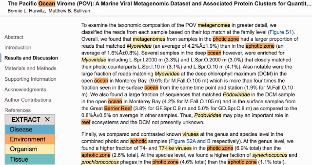

Of all the work done in JensenLab, text mining is arguably the topic with the widest span in terms of possible application areas. The following sections will give an overview of the methods that we have developed for mining information on molecular networks  from the biomedical literature as well as applications of these methods within the areas of drug target prioritization, medical informatics, and environmental informatics.

## Named entity recognition

The task of finding names of biological entities of interest, such as genes/proteins and diseases, within text and linking them to their identifiers in a database or ontology is referred to as named entity recognition (NER). In addition to being useful in its own right, it is a prerequisite for many other text-mining tasks and for most applications of text mining in the biomedical domain.

Within my group, we have long taken a dictionary-based approach to the NER task, which involves developing comprehensive dictionaries based on existing biomedical databases and ontologies, as well as maintaining a list of problematic names that must be blocked to get good precision. Combining these resources with our highly efficient multi-threaded [Tagger](https://github.com/larsjuhljensen/tagger) software allows us to quickly detect a wide range of biomedical entities in huge text corpora (Pafilis et al., 2013; Jensen, 2016), and it is even fast enough to allow real-time text mining of documents provided by users (Jensen, 2017).

We have with great success participated in two BioCreative challenges using real-time tools based on the Tagger engine. The first of these is the [EXTRACT](https://extract.jensenlab.org/) tool (Pafilis et al., 2016) that --- like it's predecessor Reflect (Pafilis et al., 2009; O'Donoghue et al., 2010) --- allows the user to run text mining on almost any web page within their browser. EXTRACT was designed to support database curators in identifying relevant parts of a document and to help extract structured data in a semi-automated fashion, and was evaluated every positively in the BioCreative V Interactive Annotation Task (Pafilis et al., 2016). The Tagger service, which is used by EXTRACT, further participated in the BioCreative V.5 Technical Interoperability and Performance Task, where it was one of the fastest and most robust services (Pletscher-Frankild & Jensen, 2019).

The speed of the Tagger software also enabled us to systematically text-mine a collection of 15 million full-text articles in collaboration with the Brunak group and the library of the Technical University of Denmark (Westergaard et al., 2018). By comparing the results from mining only the corresponding abstracts, we quantified the importance of having access to full text. To make it easy for anyone to mine a small collection of PDF documents themselves, we more recently worked with researchers at the Biomedical Sciences Research Center “Alexander Flemming” in Athens, Greece, to develop a new version of the [OnTheFly](https://www.fleming.gr/text-mining/onthefly) web tool (Baltoumas et al., 2021).

Most recently, we have collaborated closely with natural language processing researchers at the University of Turku, Finland, to improve the quality of Tagger NER results through deep learning (manuscript in preparation). Briefly, we used the intersection of the NER results from three tools to automatically produce a very large and highly reliable set of annotations. We then trained a BERT-based language model to recognize the textual contexts around four classes of entities, namely chemicals, diseases, genes/proteins, and organisms. Scoring all matches from Tagger with the trained model then allowed us to identify bad names that should be blocked, thereby augmenting the manually curated list used so far. This approach allows us to improve the quality of Tagger results without sacrificing any of its high speed.

## Relation extraction

Once the named entities have been recognized, the next text-mining task can begin, namely the extraction of relations between the entities, such as protein–protein interactions or associations between genes and diseases. We make use of several different approaches for this task.

The arguably simplest approach is co-mentioning (also known as cooccurrence), which scores the strength of association between any two entities based on how much they are mentioned together. The main strengths of the co-mentioning approach is its speed, since no text parsing is required, and the ease with which it can be applied to new problems, with no need for training data. Despite its simplicity, our co-mentioning scoring scheme is still responsible for the vast majority of associations in our network-biology database resources (more on them later), and it can provide a great starting point for manual curation as exemplified by the miRandola database of extracellular, circulating microRNAs (miRNAs) and other non-coding RNAs (ncRNAs) (Russo et al., 2018). The main drawback is that simple co-mentioning is not able to distinguish between different types of interactions.
One solution is to first identify sentences, which comention the entities of interest, and then cast the relation extraction as a text classification task. We used this approach in our collaborations on extraction of protein subcellular localization (Cejuela et al., 2018) and protein interactions of cancer fusion proteins (Tagore et al., 2019). This, however, requires a manually annotated text corpus for training, which is very time-demanding to create.

In an attempt to avoid the need for manual annotation, we developed the CoCoScore method (Junge et al. 2019). The method is based on an idea called distant supervision: instead of using annotated text, we can take a database of, e.g., physical protein interactions and combine it with text on which we have performed NER. If a sentence mentions two proteins together, which are known to interact, it is likely (but by no means certain) that the sentence states this interaction. We can thus use such sentences as positive examples. Conversely, sentences that mention two proteins, which are not known to interact, can be used as negative examples. A dataset created in this manner has a high labeling error, but this is partially compensated for by the corpus being much larger than what can feasibly be made through manual annotation. The CoCoScore method combined this approach with word embeddings representing the text to do supervised training of a sentence classifier. While we showed that the approach works and outperforms purely comention-based methods (Junge et al. 2019), much better results can be attained by using manually annotated text for training. The latter is not an entirely fair comparison, though, given that the large performance gains require extensive manual annotation work.

Most recently, we have begun using transformer-based deep-learning models together with our collaborators at University of Turku, Finland. We started by developing a model for specifically extracting physical protein–protein interactions from the biomedical literature. The interactions extracted using the first version of this model, which was based on BioBERT, were included in STRING v11.5 (Szklarczyk et al., 2021).

## Drug target prioritization

Our work on text mining has played a major role in the Illuminating the Druggable Genome (IDG) project funded by the National Institutes of Health (NIH). The goal of this large project is to shed light on druggable proteins about which virtually nothing is known, referred to as dark targets. More specifically, a dark target was defined by the absence of known drug or small molecules (that satisfy an activity threshold), low availability of antibodies, few GeneRIFs (Gene References into Function), and low number of publications mentioning the target (Oprea et al., 2018).

The next step was obviously to identify the proteins that satisfy these criteria, where we provided the text mining results from the JensenLab Tagger and derived statistics quantifying the availability of literature of every protein-coding gene in the human genome. These statistics were done using a fractional counting approach, meaning that a publication, which mentions many proteins, is not counted as a full publication about every protein it mentions. We worked with international collaborators outside the IDG consortium to use equivalent count statistics for individual years to quantify how proteins are studied over time (Sinha et al., 2018), and to apply the same approach to *Escherichia coli* and *Saccharomyces cerevisiae* proteins (Tantoso et al., 2023a, 2023b).

The text mining-based quantification of studiedness and text-mined associations between proteins, tissues, and diseases (more on these later) are integrated into the IDG Target Central Resource (TCRD) database and the Pharos web interface, which builds upon TCRD (Nguyen et al., 2017; Sheils et al., 2021; Kelleher et al., 2023). The text-mined information about proteins and diseases also formed the basis for TIN-X, another IDG web resource (Cannon et al., 2017).

## Medical informatics

Text mining has broad applications beyond just the biomedical literature, including applications in medical informatics. We have contributed to several projects in this field, using text mining to extract information about adverse drug reactions (ADRs) as well as comorbidities.

The first application is the SIDER database, which extracts information on known ADRs from the unstructured text in the side effects section of drug package inserts (Kuhn et al., 2010, 2013, 2016). As it is already known which drug a package insert pertains to, the main task is NER of the ADRs, which we do using the Tagger engine with a dictionary of MedDRA terms. This is complemented by a rule-based system to extract ADR frequency information where available, i.e. how many patients experience a given ADR.

In addition to extracting known ADRs from package inserts, we collaborated with the Brunak group to find known as well as novel ADRs from clinical narratives (Warrer et al., 2011; Eriksson et al., 2013, 2014). To this end, we used text mining to identify potential ADRs mentioned in the text notes about each patient, and then identified statistically significant temporal correlations between ADR mentions and structured medication information across a cohort of psychiatric patients. We used a similar approach on a cohort of diabetes patients, again collaborating with the Brunak group, to identify comorbidities and perform detailed patient stratification based on these (Kirk et al., 2019). A major challenge in both projects was that text from Danish hospitals is written in Danish, thus requiring development of dictionaries in Danish as well as adaptations of the Tagger to deal with long compound nouns.

## Environmental informatics

By developing additional dictionaries, we adapted the method for extracting habitat information from text. With collaborators at the Hellenic Center for Marine Research in Heraklion, Greece, we created a tool for NER of environmental descriptors from the Environment Ontology (ENVO) and collaborated with Encyclopedia Of Life (EOL) to provide structured habitat annotation based on the existing textual descriptions in EOL (Pafilis et al., 2015). We used this text-mining tool to develop Seqenv, a pipeline for annotating sequences with ENVO terms (Sinclair et al., 2016). We took part in the 4th BioNLP Shared Task with a modified version of the NER tool for ENVO terms, adapting it to NER of Bacteria Biotype terms and achieving the best results on this task of the participating teams (Cook et al., 2016).

  
*Example of NER of organisms and environmental descriptors using the EXTRACT tool (Pafilis et al., 2016).*

We developed a corpus with manual species annotations in 800 abstracts called Species-800 (Pafilis et al., 2013), which has become one of the standard corpora used for benchmarking of text transformer models in the biomedical domain, such as BioBERT. We thus decided to improve the quality of the annotations, especially refining the annotation boundaries, and to expand the corpus with 200 additional abstracts. We have shown that this new corpus, Species-1000, gives much improved performance for a wide range of transformer models compared to Species-800 (Luoma et al., 2023).

## References

Baltoumas FA, Zafeiropoulou S, Karatzas E, Paragkamian S, Thanati F, Iliopoulos I,  Eliopoulos AG, Schneider R, Jensen LJ, Pafilis E and Pavlopoulos GA (2021). OnTheFly 2.0: a text-mining web application for automated biomedical entity recognition, document annotation, network and functional enrichment analysis. *Nucleic Acids Research Genomics and Bioinformatics*, **3**:lqab090.  
[Abstract](https://pubmed.ncbi.nlm.nih.gov/34632381/) [Full text](https://doi.org/10.1093/nargab/lqab090) [Preprint](https://doi.org/10.1101/2021.05.14.444150) [WWW](http://onthefly.pavlopouloslab.info) 

Cannon DC, Yang JJ, Mathias SL, Ursu O, Mani S, Waller A, Schürer SC, Jensen LJ, Sklar LA, Bologa CG and Oprea TI (2017). TIN-X: Target Importance and Novelty Explorer. *Bioinformatics*, **33**:2601-2603.  
[Abstract](https://pubmed.ncbi.nlm.nih.gov/28398460) [Full text](https://doi.org/10.1093/bioinformatics/btx200) [WWW](http://www.newdrugtargets.org/) 

Cejuela JM, Vinchurkar S, Goldberg T, Shankar MSP, Baghudana A, Bojchevski A, Uhlig C, Ofner A, Raharja-Liu P, Jensen LJ\* and Rost B\* (2018). LocText: relation extraction of protein localizations to assist database curation. *BMC Bioinformatics*, **19**:15.  
[Abstract](https://pubmed.ncbi.nlm.nih.gov/29343218) [Full text](https://doi.org/10.1186/s12859-018-2021-9) 

Cook H, Pafilis E and Jensen LJ (2016). A dictionary- and rule-based system for identification of bacteria and habitats in text. *Proceedings of the 4th BioNLP Shared Task Workshop*, 50-55.  
[Full text](https://aclweb.org/anthology/W/W16/W16-3006.pdf)

Eriksson R, Jensen PB, Pletscher-Frankild S, Jensen LJ and Brunak S (2013). Dictionary construction and identification of possible adverse drug events in Danish clinical narrative text. *Journal of the American Medical Informatics Association*, **20**:947-953.  
[Abstract](https://pubmed.ncbi.nlm.nih.gov/23703825) [Full text](https://doi.org/10.1136/amiajnl-2013-001708) 

Eriksson R, Werge T, Jensen LJ and Brunak S (2014). Dose-specific adverse drug reaction identification in electronic patient records: temporal data mining in an inpatient psychiatric population. *Drug Safety*, **37**:237-247.  
[Abstract](https://pubmed.ncbi.nlm.nih.gov/24634163) [Full text](https://doi.org/10.1007/s40264-014-0145-z) 

Jensen LJ (2016). One tagger, many uses: Illustrating the power of ontologies in dictionary-based named entity recognition. *Proceedings of the Joint International Conference on Biological Ontology and BioCreative*.  
[Full text](http://ceur-ws.org/Vol-1747/BIT102_ICBO2016.pdf)

Jensen LJ (2017). Tagger: BeCalm API for rapid named entity recognition. *Proceedings of the BioCreative V.5 Challenge Evaluation Workshop*, 122-129  
[Full text](http://www.biocreative.org/media/store/files/2017/BioCreative_V5_paper17.pdf)

Junge A and Jensen LJ (2019). CoCoScore: Context-aware co-occurrence scoring for text mining applications using distant supervision. *Bioinformatics*, **36**:264-271.  
[Abstract](https://pubmed.ncbi.nlm.nih.gov/31199464) [Full text](https://doi.org/10.1093/bioinformatics/btz490) [Preprint](https://doi.org/10.1101/444398) [Source code](https://github.com/JungeAlexander/cocoscore) 

Kelleher KJ, Sheils TK, Mathias SL, Yang JJ, Metzger VT, Siramshetty VB, Nguyen D-T, Jensen LJ, Vidović D, Schürer SC, Holmes J, Sharma KR, Pillai A, Bologa CG, Edwards JS, Mathé EA and Oprea TI (2023). Pharos 2023: an integrated resource for the understudied human proteome. *Nucleic Acids Research*, **51**:D1405-D1416.  
[Abstract](https://pubmed.ncbi.nlm.nih.gov/36624666/) [Full text](https://doi.org/10.1093/nar/gkac1033) [WWW](https://pharos.nih.gov) 

Kirk IK, Simon C, Banasik K, Holm PC, Haue AD, Jensen PB, Jensen LJ, Rodríguez CL, Pedersen MK, Eriksson R, Andersen HU, Almdal T, Bork-Jensen J, Grarup N, Borch-Johnsen K, Pedersen O, Pociot F, Hansen T, Bergholdt R, Rossing P and Brunak S (2019). Linking glycemic dysregulation in diabetes to symptoms, comorbidities, and genetics through EHR data mining. *eLife*, **8**:e44941.  
[Abstract](https://pubmed.ncbi.nlm.nih.gov/31818369) [Full text](https://doi.org/10.7554/eLife.44941) 

Kuhn M, Campillos M, Letunic I, Jensen LJ and Bork P (2010). A side effect resource to capture phenotypic effects of drugs. *Molecular Systems Biology*, **6**:343.  
[Abstract](https://pubmed.ncbi.nlm.nih.gov/20087340) [Full text](https://doi.org/10.1038/msb.2009.98) [WWW](http://sideeffects.embl.de) 

Kuhn M, Al Banchaabouchi M, Campillos M, Jensen LJ, Gross C, Gavin A-C and Bork P (2013). Systematic identification of proteins that elicit drug side effects. *Molecular Systems Biology*, **9**:663.  
[Abstract](https://pubmed.ncbi.nlm.nih.gov/23632385) [Full text](https://doi.org/10.1038/msb.2013.10) 

Kuhn M, Letunic I, Jensen LJ and Bork P (2016). The SIDER database of drugs and side effects. *Nucleic Acids Research*, **44**:D1075-D1079.  
[Abstract](https://pubmed.ncbi.nlm.nih.gov/26481350) [Full text](https://doi.org/10.1093/nar/gkv1075) [WWW](http://sideeffects.embl.de/) 

Luoma M\*, Nastou K\*, Ohta T, Toivonen H, Pafilis E, Jensen LJ\* and Pyysalo S\* (2023). S1000: A better taxonomic name corpus for biomedical information extraction. *Bioinformatics*, **39**:btad369.  
[Abstract](https://pubmed.ncbi.nlm.nih.gov/37289518/) [Full text](https://doi.org/10.1093/bioinformatics/btad369) [Preprint](https://doi.org/10.1101/2023.02.20.528934) 

Nguyen DT, Mathias S, Bologa C, Brunak S, Fernandez N, Gaulton A, Hersey A, Holmes J, Jensen LJ, Karlsson A, Liu G, Ma'ayan A, Mandava G, Mani S, Mehta S, Overington J, Patel J, Rouillard AD, Schürer S, Sheils T, Simeonov A, Sklar LA, Southall N, Ursu O, Vidovic D, Waller A, Yang J, Jadhav A, Oprea T and Guha R (2017). Pharos: Collating protein information to shed light on the druggable genome. *Nucleic Acids Research*, **45**:D995-D1002.  
[Abstract](https://pubmed.ncbi.nlm.nih.gov/27903890) [Full text](https://doi.org/10.1093/nar/gkw1072) [WWW](https://pharos.nih.gov) 

O’Donoghue SI, Horn H, Pafilis E, Haag S, Kuhn M, Satagopam VP, Schneider R and Jensen LJ (2010). Reflect: a practical approach to web semantics. *Journal of Web Semantics*, **8**:182-189.  
[Full text](https://doi.org/10.1016/j.websem.2010.03.003) 

Oprea TI, Bologa CG, Brunak S, Campbell A, Gan GN, Gaulton A, Gomez SM, Guha R, Hersey A, Holmes J, Jadhav A, Jensen LJ, Johnson GL, Karlson A, Leach AR, Ma'ayan A, Malovannaya A, Mani S, Mathias SL, McManus MT, Meehan TF, von Mering C, Muthas D, Nguyen DT, Overington JP, Papadatos G, Qin J1, Reich C, Roth BL, Schürer SC, Simeonov A, Sklar LA, Southall N, Tomita S, Tudose I, Ursu O, Vidovic D, Waller A, Westergaard D, Yang JJ and Zahoránszky-Köhalmi G (2018). Unexplored therapeutic opportunities in the human genome. *Nature Reviews Drug Discovery*, **17**:317-332.  
[Abstract](https://pubmed.ncbi.nlm.nih.gov/29472638) [Full text](https://doi.org/10.1038/nrd.2018.14) 

Pafilis E, O'Donoghue SI, Jensen LJ, Horn H, Kuhn M, Brown NP and Schneider R (2009). Reflect: augmented browsing for the life scientist. *Nature Biotechnology*, **27**:508-510.  
[Abstract](https://pubmed.ncbi.nlm.nih.gov/19513049) [Full text](https://doi.org/10.1038/nbt0609-508) [WWW](http://reflect.ws) 

Pafilis E, Pletscher-Frankild S, Fanini L, Faulwetter S, Pavloudi C, Vasileiadou A, Arvanitidis C and Jensen LJ (2013). The SPECIES and ORGANISMS resources for fast and accurate identification of taxonomic names in text. *PLOS ONE*, **8**:e65390.  
[Abstract](https://pubmed.ncbi.nlm.nih.gov/23823062) [Full text](https://doi.org/10.1371/journal.pone.0065390) [WWW](https://species.jensenlab.org) 

Pafilis E, Pletscher-Frankild S, Schnetzer J, Fanini L, Faulwetter S, Pavloudi C, Vasileiadou V, Leary P, Hammock J, Schulz K, Parr CS, Arvanitidis C and Jensen LJ (2015). ENVIRONMENTS and EOL: identification of Environment Ontology terms in text and the annotation of the Encyclopedia of Life. *Bioinformatics*, **31**:1872-1874.  
[Abstract](https://pubmed.ncbi.nlm.nih.gov/25619994) [Full text](https://doi.org/10.1093/bioinformatics/btv045) [WWW](https://environments.jensenlab.org) 

Pafilis E, Buttigieg PL, Ferrell B, Pereira E, Schnetzer J, Arvanitidis C and Jensen LJ (2016). EXTRACT: Interactive extraction of environment metadata and term suggestion for metagenomic sample annotation. *Database*, **2016**:baw005.  
[Abstract](https://pubmed.ncbi.nlm.nih.gov/26896844) [Full text](https://doi.org/10.1093/database/baw005) [WWW](https://extract.jensenlab.org) 

Pletscher-Frankild S and Jensen LJ (2019). Design, implementation, and operation of a rapid, robust named entity recognition web service. *Journal of Cheminformatics*, **11**:19.  
[Abstract](https://pubmed.ncbi.nlm.nih.gov/30850898) [Full text](https://doi.org/10.1186/s13321-019-0344-9) 

Russo F, Di Bella S, Vannini F, Berti G, Scoyni F, Cook HV, Santos A, Nigita G, Bonnici V, Laganà A, Geraci F, Pulvirenti A, Giugno R, De Masi F, Belling K, Jensen LJ, Brunak S, Pellegrini M and Ferro A (2018). miRandola 2017: a curated knowledge base of non-invasive biomarkers. *Nucleic Acids Research*, **46**:D354-D359.  
[Abstract](https://pubmed.ncbi.nlm.nih.gov/29036351) [Full text](https://doi.org/10.1093/nar/gkx854) 

Sheils T, Mathias S, Kelleher K, Siramshetty V, Nguyen D-T, Bologa C, Jensen LJ, Vidovic D, Koleti A, Schürer S, Waller A, Yang J, Holmes J, Bocci G, Southall N, Dharkar P, Mathé E, Simeonov A and Oprea TI (2021). TCRD and Pharos 2020: Mining the human proteome for disease biology. *Nucleic Acids Research*, **49**:D1334-D1346.  
[Abstract](https://pubmed.ncbi.nlm.nih.gov/33156327) [Full text](https://doi.org/10.1093/nar/gkaa993) [WWW](https://pharos.nih.gov) 

Sinclair L, Ijaz UZ, Jensen LJ, Coolen MJL, Gubry-Rangin C, Chroňáková A, Oulas A, Pavloudi C, Schnetzer J, Weimann A, Ijaz A, Eiler A, Quince C and Pafilis E (2016). Seqenv: linking sequences to environments through text mining. *PeerJ*, **4**:e2690.  
[Abstract](https://pubmed.ncbi.nlm.nih.gov/28028456) [Full text](https://doi.org/10.7717/peerj.2690) 

Sinha S, Eisenhaber B, Jensen LJ, Kalbuaji B and Eisenhaber F (2018). Darkness in the human gene and protein function space: Widely modest or absent illumination by the life science literature and the trend for fewer protein function discoveries since 2000. *Proteomics*, **18**:e1800093.  
[Abstract](https://pubmed.ncbi.nlm.nih.gov/30265449) [Full text](https://doi.org/10.1002/pmic.201800093) 

Tantoso E, Eisenhaber B, Sinha S, Jensen LJ and Eisenhaber F (2023a). About the dark corners in the gene function space of Escherichia coli remaining without illumination by scientific literature. *Biology Direct*, **18**:7.  
[Full text](https://doi.org/10.1186/s13062-023-00362-0) 

Tantoso E, Eisenhaber B, Sinha S, Jensen LJ and Eisenhaber F (2023b). Did the early full genome sequencing of yeast boost gene function discovery? *Biology Direct*, **18**:46.  
[Abstract](https://pubmed.ncbi.nlm.nih.gov/37574542/) [Full text](https://doi.org/10.1186/s13062-023-00403-8) 

Warrer P, Hansen EH, Jensen LJ and Aagaard L (2011). Using text-mining techniques in electronic patient records to identify ADRs from medicine use. *British Journal of Clinical Pharmacology*, **73**:674-684.  
[Abstract](https://pubmed.ncbi.nlm.nih.gov/22122057) [Full text](https://doi.org/10.1111/j.1365-2125.2011.04153.x) 

Westergaard D, Stærfeldt H-H, Tønsberg C, Jensen LJ\* and Brunak S\* (2018). Text mining of 15 million full-text scientific articles. *PLOS Computational Biology*, **14**:e1005962.  
[Abstract](https://pubmed.ncbi.nlm.nih.gov/29447159) [Full text](https://doi.org/10.1371/journal.pcbi.1005962) 

\* Joint first and/or joint corresponding authors.  

