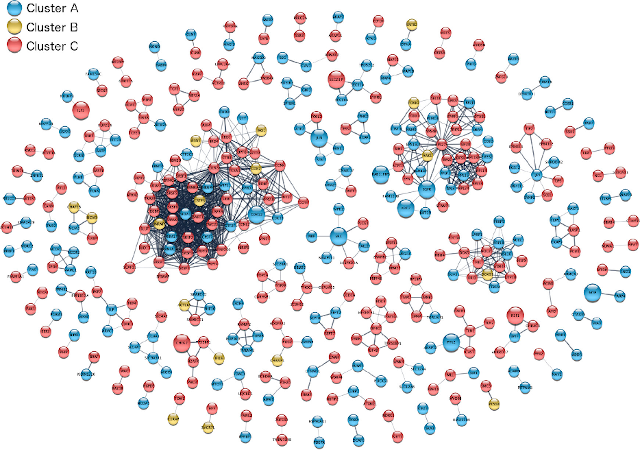
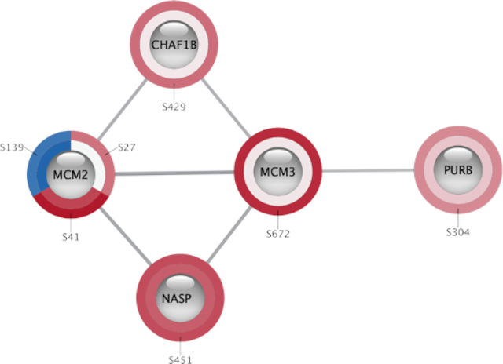
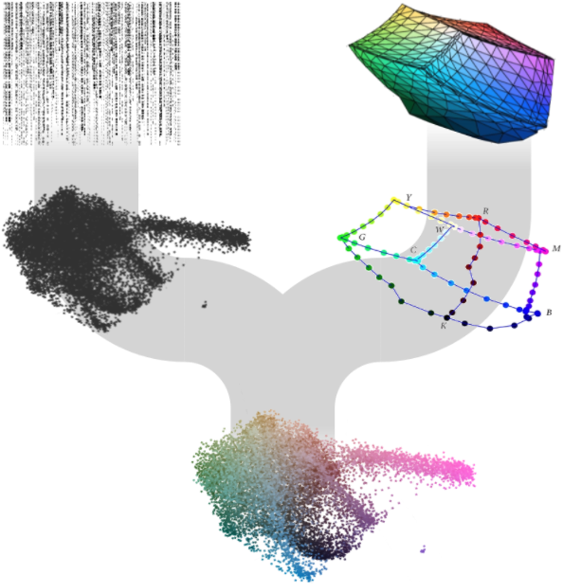
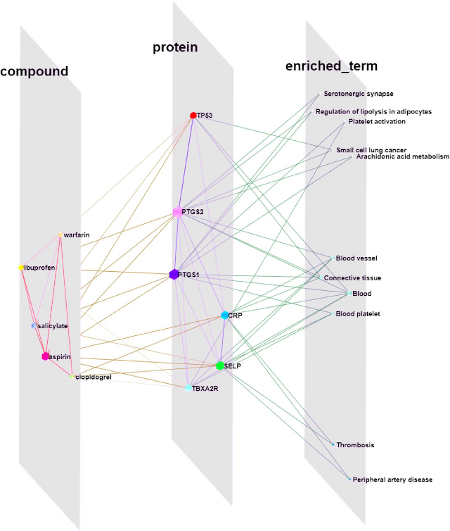
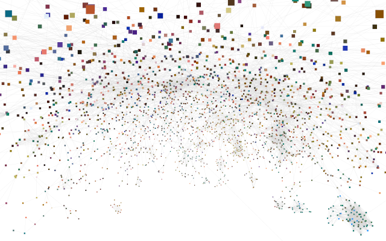

Visualization of proteomics or transcriptomics data data is one of the major use cases for protein networks, and the STRING database has become particularly popular for this. However, all too often researchers simply put a gene list into the STRING web interface and show the resulting network. We have thus developed a number of tools to help create better, more informative network visualizations.

## Network-based visualization

  
*Visualization of proteomics data on a clustered STRING network using Cytoscape stringApp (Doncheva et al., 2019).*

To make it easier for omics researchers to create better STRING network visualizations of their data, we started a collaboration with John “Scooter” Morris, who is one of the core developers of Cytoscape, the most used tool for biological network visualization. Together, we developed a Cytoscape app, [stringApp](https://apps.cytoscape.org/apps/stringapp), which provides the query functionality and visual style of STRING within Cytoscape (Doncheva et al., 2019, 2023). Users can then use the full functionality of Cytoscape and its many other apps to, for example, import omics data, map log-fold-change onto proteins as colors, cluster the network, and lay it out to produce publication-quality figures. The app has also become a hub that ties together many of the other resources developed within the group, importing information from both the COMPARTMENTS and TISSUES databases, and allowing users to query the DISEASES database to obtain a STRING network of proteins associated with a disease of interest. Despite having existed for much shorter than many other apps, it has already become the second most downloaded app from the Cytoscape App Store.

## Complex omics data

  
*Site-specific phosphoproteomics data shown on a small STRING network using Omics Visualizer (Legeay et al., 2020).*

One challenge in Cytoscape, which is not addressed by stringApp, is how to visualize complex omics datasets with multiple values for each gene/protein, such as time-course experiments and phosphoproteomics data. To address this, we designed the [Omics Visualizer](https://apps.cytoscape.org/apps/omicsvisualizer) app, which allows users to import such data and show multiple values on each node (Legeay et al., 2020). We do this by splitting nodes into a variable number of segments that can be individually colored based on the data, thus having a separate segment for each time point and/or phosphorylation site. The app is designed to integrate closely with stringApp, thus allowing users to easily import, for example, phosphoproteomics data, retrieve a STRING network, and show the site-specific data on the network.

  
*The U-CIE method for color-encoding of high-dimensional data, such as single-cell RNA-seq (Koutrouli et al., 2022).*

Sometimes the data are too high-dimensional to show the individual dimensions; for example, one cannot visualize the expression levels in every cell of a single-cell RNA-seq experiment onto a protein network. When faced with this challenge, we developed the [U-CIE](https://u-cie.jensenlab.org/) method, which combines dimensionality reduction with the CIELAB color space (Koutrouli et al., 2022). The simple idea is to first compress the data into three dimensions, and then fit the resulting point cloud into a perceptually uniform color space. This allows the expression signature of each gene to be summarized by a single color, which can then easily be shown on a protein network.

## Networks in 3D

  
*Arena3Dweb visualization of a drug–protein–term network created using Cytoscape stringApp and Arena3DwebApp (Kokoli et al., 2023).*

To further improve network visualization, taking it into 3D, we have recently collaborated with the group of Georgios Pavlopoulos at Biomedical Sciences Research Center “Alexander Fleming” in Athens. Specifically, we developed [Arena3DwebApp](https://apps.cytoscape.org/apps/arena3dwebapp) that integrates the latest version of their Arena3Dweb tool with Cytoscape (Kokoli et al., 2023). This allows users to prepare their network in Cytoscape and then easily transfer it to Arena3Dweb for interactive 3D visualization.

  
*Physical interaction network from STRING, layed out in Cytoscape, colored based on scRNA-seq data using U-CIE, and visualized in virtual reality with Cy2VR.*

We are also experimenting with Virtual Reality (VR) for interactive exploration of large networks in 3D. To this end, we have developed [Cy2VR](https://github.com/larsjuhljensen/Cy2VR), a tool for converting any Cytoscape network into a WebXR-based 3D visualization that can be explored on a wide range of devices, including phones and low-end VR headsets. See for example:
* [STRING network colored based on scRNA-seq data using U-CIE](/assets/vr/u-cie_network.html)
* [FAVA network created based on scRNA-seq and proteomics data](/assets/vr/fava_network.html)

## References

Doncheva NT, Morris JH, Gorodkin J and Jensen LJ (2019). Cytoscape stringApp: Network analysis and visualization of proteomics data. *Journal of Proteome Research*, **18**:623-632.  
[Abstract](https://pubmed.ncbi.nlm.nih.gov/30450911) [Full text](https://doi.org/10.1021/acs.jproteome.8b00702) [Preprint](https://doi.org/10.1101/438192) [WWW](http://apps.cytoscape.org/apps/stringapp) 

Doncheva NT, Morris JH, Holze H, Kirsch R, Nastou KC, Cuesta-Astroz Y, Rattei T, Szklarczyk D, von Mering C and Jensen LJ (2023). Cytoscape stringApp 2.0: Analysis and visualization of heterogeneous biological networks. *Journal of Proteome Research*, **22**:637-646.  
[Abstract](https://pubmed.ncbi.nlm.nih.gov/36512705/) [Full text](https://doi.org/10.1021/acs.jproteome.2c00651) [WWW](https://apps.cytoscape.org/apps/stringapp) 

Kokoli M, Karatzas E, Baltoumas FA, Schneider R, Pafilis E, Paragkamian S, Doncheva NT, Jensen LJ and Pavlopoulos GA (2023). Arena3Dweb: Interactive 3D visualization of multilayered networks supporting multiple directional information channels, clustering analysis and application integration. *Nucleic Acids Research Genomics and Bioinformatics*, **5**:lqad053.  
[Abstract](https://pubmed.ncbi.nlm.nih.gov/37260509/) [Full text](https://doi.org/10.1093/nargab/lqad053) 

Koutrouli M, Morris JH, and Jensen LJ (2022). U-CIE [/juː 'siː/]: Color encoding of high-dimensional data. *Protein Science*, **31**:e4388.  
[Abstract](https://pubmed.ncbi.nlm.nih.gov/36040253/) [Full text](https://doi.org/10.1002/pro.4388) [Preprint](https://doi.org/10.1101/2021.12.02.470966) [WWW](https://u-cie.jensenlab.org) 

Legeay M, Doncheva NT, Morris JH and Jensen LJ (2020). Visualize omics data on networks with Omics Visualizer, a Cytoscape App. *F1000Research*, **9**:157.  
[Abstract](https://pubmed.ncbi.nlm.nih.gov/32399202) [Full text](https://doi.org/10.12688/f1000research.22280.1) 

\* Joint first and/or joint corresponding authors.  

