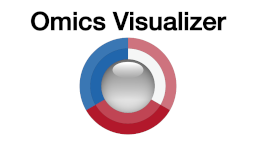

## Learning objectives

In these exercises, we will use the [Omics Visualizer](http://apps.cytoscape.org/apps/omicsvisualizer) app for [Cytoscape](http://cytoscape.org/) to retrieve molecular networks from the [STRING](https://string-db.org/) database and visualize site-specific information on the nodes. The exercises will teach you how to:

* load a table with omics data
* filter the data within the table
* retrieve a STRING network for a table
* connect the table to a network
* visualize site-specific data onto networks
* visualize time-series data onto networks

## Prerequisites

To follow the exercises, please make sure that you have the latest version of Cytoscape installed. Then start Cytoscape and go to **Apps → App Manager** to check for new apps, install them and update the current ones if necessarily. The exercises require you to have certain Cytoscape apps installed. Search for the **Omics Visualizer** in the search field; if it is not already installed, select it and press the **Install** button to install it. Similarly, make sure you have the **stringApp**, **enhancedGraphics**, and their dependencies installed before closing the App Manager.

## Exercise 1

In this exercise, we will load a data table with proteomics data, filter it, retrieve a STRING network for the proteins, and visualize site-specific information onto the protein network.

We will work with phosphoproteomics data from an ovarian cancer study ([Francavilla et al., 2017](https://doi.org/10.1016/j.celrep.2017.03.015)). The study used mass spectrometry to compare the phosphoproteome of primary cells derived from epithelial ovarian cancer (EOC) to those of two healthy tissues, namely distal fallopian tube epithelium (FTE) and ovarian surface epithelium (OSE). Each protein can have multiple significantly regulated phosphorylation sites, each of which is associated with two log-fold change values (one for each control tissue), a Benjamini–Hochberg adjusted p-value, and a cluster assignment that groups sites with similar behavior across samples. An adapted and simplified table with the data from this study is available [here](/assets/Francavilla2017CellRep.tsv).

### 1.1 Table import

Start Cytoscape or close the current session from the menu **File → Close**. Go to the menu **Apps → Omics Visualizer → Import table from file**. Download and open the [text file](/assets/Francavilla2017CellRep.tsv) with the data described above. The import dialog gives you the option to name the table, shows how the file is interpreted given the current settings, and allows you to change these as needed. As no changes should be needed for this file, simply click **OK** to complete the import.

### 1.2 Table row filtering

Omics Visualizer allows you to filter the rows in the table before visualizing them on a network. Click the filter button above the network or go to the menu **Apps → Omics Visualizer → Filter table**. In the filter dialog, you can build logical rules that take into account multiple columns in the table. However, here we will create a simple filter to keep only the phosphorylation sites that are statistically significant at a 1% false discovery rate.

Select **Adj p-value** as the column to use for filtering, choose **<=** as the operator, enter **0.01** as the value, and click **Apply**. The filter button above the table should turn green to show that you have an active filter, and the table will only show the rows that passed the filter.

[Filter table](cycmd:ov filter filter="(Adj p-value,EQUALS,0.01)"){: .btn .btn--cybrowser .btn--primary}

_How many rows do you have in the table? How many rows are shown after you applied the filter?_

### 1.3 STRING network retrieval

Before we can make a network visualization of the data, we obviously need to obtain a network from somewhere. While Omics Visualizer is designed to be able to work well with networks from any source, it integrates nicely with [stringApp](http://apps.cytoscape.org/apps/stringapp), which you can learn more about [here](/training/stringapp/).

Click the STRING button above the table or go to the menu **Apps → Omics Visualizer → Retrieve STRING network**. In the dialog, you can specify the species your data is from, the table column that holds the gene/protein identifiers that we want to query with, and the confidence score cutoff for the interactions retrieved from STRING. Here, we want to retrieve a **Homo sapiens** network based on the accession numbers in the **UniProt** column with a STRING confidence score cutoff of **0.7**. Select those values, click **Retrieve network**, and you should obtain a STRING network for the proteins in the filtered data table.

[Retrieve a STRING network](cycmd:ov retrieve queryColumn="UniProt" cutoff=0.7 taxonID=9606){: .btn .btn--cybrowser .btn--primary}

_How many nodes do you have in your network? Does it corresponds to the number of rows you queried?_

### 1.4 Donut visualization

We are now ready to start mapping the site-specific phosphoproteomics data onto the network. Specifically, we will visualize the two log-fold change values for each site as concentric rings around the nodes in the network.

Click the donut button above the table or go to the menu **Apps → Omics Visualizer → Create donut visualization**. In the first dialog you choose the data to visualize; select **EOC vs FTE** as the first value set, click the **+** to add a second, select **EOC vs OSE** as the second value set, and choose **Continuous** as mapping. To label the visualization with the modified position(s) in the protein, select **AA position** as labels. Click **Next >** to get to the second dialog, which allows you to select the color palette and fine-tune the color gradient; as the default values are fine, simply click **Draw** to produce the visualization.

_How are multiple sites on the same protein shown? Do different different within a protein always show similar changes?_

### 1.5 Pie visualization

With the donut visualization we showed the quantitative changes in phosphorylation of each site. The study by Francavilla and coworkers also used this information to assign each site to one of three clusters (A, B and C) based on its behavior across samples. We will add this qualitative information to the network as a pie visualization.

Click the pie button above the table or go to **Apps → Omics Visualizer → Create pie visualization.**. In the first dialog, select **Cluster** as values and do not select any labels. The mapping has automatically changed to **Discrete** and cannot be changed because the column does not contain numeric data. Click **Next >** to get to the second dialog and then **Draw** to create the visualization. The nodes themselves have now been replaced with pie visualizations that color each site depending which cluster it belongs to.

_What are the advantages and disadvantages of donut vs. pie visualizations?_

### 1.6 Customizing colors

Looking at the colors, it is clear that cluster assignments very well summarize the quantitative data on regulation; one cluster A are the down-regulated sites, cluster C are the up-regulated sites, and cluster B mostly contains sites that show different behavior in the two control tissues. However, the colors assigned to the clusters do not show this in an intuitive way.

To change the colors open the pie visualization dialog again and click **Next >**. Customize the colors so that cluster A is blue, cluster B is yellow, and cluster C is red. Click **Draw** to update the visualization. You should now clearly see the consistency the log-fold change values shown as donuts and the cluster assignments shown as pies.

Since the two visualizations are now redundant, we can simplify the figure by deleting the detailed donut visualization. Open the donut dialog and click **Delete Visualization** to remove it.

_Would the pie or the donut visualization be best suited for a big network with several hundreds of proteins?_

## Exercise 2

In this exercise, we will load a protein–protein interaction network and a data table with time-course transcriptomic data, connect the two, extract a subnetwork of significantly regulated genes, and visualize the time-course data onto the network.

We will specifically work with two published _Saccaromyces cerevisiae_ studies, namely a yeast two-hybrid screen of physical protein–protein interactions ([Yu et al., 2008](https://doi.org/10.1126/science.1158684)) and an RNA-seq study of the hypoxic response ([Bendjilali et al., 2017](https://doi.org/10.1534%2Fg3.116.034991)). The latter study measured gene expression at eight time points and used two statistical metrics to identify significant changes.

### 2.1 Network import

Start Cytoscape or close the current session from the menu **File → Close**. Download the [yeast interactome file](/assets/omicsvisualizer/Yu2008Science.tsv) and import it in Cytoscape with the menu **File → Import → Network from File ...**. Be careful, the file contains no header, so you must go to the **Advanced Options ...** and unselect **Use first line as column names**. Then select **Column 1** as the source node (green dot) and **Column 2** as the target (orange target).

### 2.2 Table import

Download the [transcriptomic data file](/assets/omicsvisualizer/Bendjilali2017G3.tsv) and go to the menu **Apps → Omics Visualizer → Import table from file** to import the file. The import dialog gives you the option to name the table, shows how the file is interpreted given the current settings, and allows you to change these as needed. In this case, we have to change a data type for one of the columns, namely min180, which should be interpreted as floating point numbers. Click on the column **min180**, choose **1.0**, and click outside the dropdown menu to close it. Click **OK** to complete the import.

### 2.3 Connect table

We now need to tell Omics Visualizer how to connect the data table with the imported network. Since the gene names in the table are the node names in the network, we will link the table and network using these as keys.

Click the connect button above the table or go to the menu **Apps → Omics Visualizer → Manage table connections**. In the **Add a new connection** panel, select the network collection **Yu2008Science.tsv** (unless you renamed the network collection). Select **shared name** as key column from the network and **gene** as key column from the table. Click **Connect** to connect the table with the network. The connection should now be visible in the **Connected Network Collections** panel. Click on **Close**.
If your table is successfully connected to the network then you should see that the pie and donut visualization buttons are now available.

### 2.4 Extract subnetwork

The interaction network cover 1278 protein-coding genes, almost all of which are also included in the transcriptomic data. However, most of them are not significantly regulated. We will thus now use the filter functionality of Omics Visualizer to select the significantly regulated genes and extract a subnetwork containing only those.

Click the filter button above the network or go to the menu **Apps → Omics Visualizer → Filter table**. In the filter dialog, you can build logical rules that take into account multiple columns in the table. Select **autocor.adj** as the column to use for filtering, choose **<=** as the operator, enter **0.05** as the value. Click the **+** button to add the equivalent filter for the column **DESeq.adj**, and click **Apply** then **Close**. The filter button above the table should turn green to show that you have an active filter, and the table will only show rows for the genes that passed the filter.

[Filter table](cycmd:ov filter filter="{(autocor.adj,LOWER_EQUALS,0.05),(DESeq.adj,LOWER_EQUALS,0.05)}"){: .btn .btn--cybrowser .btn--primary}

To extract a subnetwork for these genes, first make sure that the yeast interactome is the active network shown in Cytoscape. Then go to the Omics Visualizer table, select all rows (e.g. by pressing **Ctrl+A** on Windows/Linux or **command+A** on Mac), and right-click the rows and choose **Select nodes from selected rows** from the context menu. Go to the menu **File → New Network → From Selected Nodes, All Edges** to create a network of only the significantly regulated genes. Finally, apply a layout (e.g. yFiles Organic Layout) to the new network to bring the nodes closer together.

_How many nodes are in the subnetwork? Does it corresponds to the number of filtered rows from the table?_

### 2.5 Donut visualization

We will now visualize the time-series data onto the subnetwork, showing the columns with different time points as slices in a donut visualization.

Click the donut button above the table or go to the menu **Apps → Omics Visualizer → Create donut visualization**. In the first dialog, choose the data to visualize: select **min0** as the first value set, click the **+**, select **min5** as the second value set, and repeat this process to add all the time points in order. Choose **Continuous** as mapping, and **--- NONE ---** as labels. Click **Next >** to get to the second dialog, select ring is **row** to turn the columns into slices, and then simply **Draw** to visualize the data with the default palette and color gradient.

_Is the visualization applied to the first network too?_

### 2.6 Customizing visualization

The default network style applied by Cytoscape creates rectangular nodes, which causes the donuts to become elliptic rather than circular. To fix this, go to the **Style** tab and check **Lock node width and height**. You may also want to change **Fill Color** to white in order to make the data visualization stand out more clearly.

The RNA-seq data contains the normalized read count for each gene at each time point. Since some genes have orders of magnitude more reads than others, the automatically assigned color scale does not work well. Click the donut button above the table or go to the menu **Apps → Omics Visualizer → Create donut visualization** and click **Next >** in the first dialog without modifying anything. In the second dialog, set **Max** to **4000**, **Middle** to **2000**, and **Min** to **0**. Click **Draw** to update the visualization.

_How could the input data be transformed to avoid this problem?_

## Supporting lectures

The theoretical background for these exercises is covered in these short online lectures:

## Supporting literature

Legeay M, Doncheva NT, Morris JH and Jensen LJ (2020). Visualize omics data on networks with Omics Visualizer, a Cytoscape App. *F1000Research*, **9**:157.  
[Abstract](https://pubmed.ncbi.nlm.nih.gov/32399202) [Full text](https://doi.org/10.12688/f1000research.22280.1)

