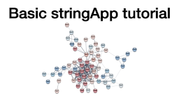

## Learning objectives

In these exercises, we will use the [Proteo Visualizer](http://apps.cytoscape.org/apps/ProteoVisualizer) app for [Cytoscape](http://cytoscape.org/) to retrieve molecular networks from the [STRING](https://string-db.org/) database and visualize experimental data on the nodes with the [Omics Visualizer](http://apps.cytoscape.org/apps/omicsvisualizer) app. The exercises will teach you how to:

* retrieve a STRING network with protein groups input
* load a table with omics data
* visualize the data (one condition)
* visualize the data (multiple conditions)

## Prerequisites

To follow the exercises, please make sure that you have the latest version of Cytoscape installed. Then start Cytoscape and update the current apps if necessary by checking the **App Updates** icon in the right-most corner of the menu bar. 

The exercises require you to have certain Cytoscape apps installed. Go to the [Cytoscape App Store](https://apps.cytoscape.org/) in your web browser and search for [Proteo Visualizer](http://apps.cytoscape.org/apps/ProteoVisualizer), select the app and press the **Install** button to install it. Similarly, make sure you have [stringApp](https://apps.cytoscape.org/apps/stringApp) and [Omics Visualizer](http://apps.cytoscape.org/apps/OmicsVisualizer) installed before switching back to Cytoscape.

## Exercise 1

In this exercise, we will retrieve a STRING network for the protein groups from a study, load the table with experimental data, and visualize the information onto the protein network.

We will work with the set of regulated proteins from a single cell quantitative proteomics analysis ([Guo et al., MCP, 2022](https://www.mcponline.org/article/S1535-9476(22)00075-5/fulltext)). The study used mass spectrometry to compare the proteome of human oocyte after *in-vitro* maturation (IVM) and *in-vivo* maturation (IVO) with the proteome of germinal vesicles (GV). Among other data, each protein group (found in the column *Protein.IDs*) is associated with three log-fold change values (one column for each pair-wise comparison): *Log2(IVM/GV)*, *Log2(IVO/GV)*, and *Log2(IVM/IVO)*. The table with the data from this study is available [here](https://www.mcponline.org/cms/10.1016/j.mcpro.2022.100267/attachment/4d014d61-3595-4578-a69e-b84787eccd7e/mmc4.xlsx). We recommend using Microsoft Excel, Numbers or a similar program to open the file. 

### 1.1 Protein network retrieval

Open the downloaded supplementary table (*mmc4*) and copy *all* protein group UniProt accessions from the *Protein.IDs* column (10th column in the table). In Cytoscape, go to the menu **Apps → Proteo Visualizer → Retrieve STRING network**. In the resulting dialog, paste the list of protein groups into the **Protein groups** field, enter a name for the new network into the **Network name** field (e.g. *Regulated proteins Guo et al*), and change the **Confidence (score) cutoff** to **0.7**. Once all options are set to the desired values, press **Retrieve network**.

### 1.2 Data import

Network nodes and edges can have additional information associated with them that we can load into Cytoscape and use for visualization. We will import the data from the same table.

To import the node attributes file into Cytoscape, go to **File → Import → Table from File** and navigate to the directory that contains the **mmc4** table file. In the resulting dialog entitled *Import Columns From Table*, make sure that the drop-down menu next to **Where to Import Table Data** is set to the option **To a Network Collection**. Next, change the **Key Column for Network** from **shared name** to **query term** or **proteovis::protein group**. To tell Cytoscape not to include the extra line with the table description, go to **Advanced Options...** (Bottom left corner), set the option **Start Import Row** to **2**, and click **OK**. Now scroll to the column named **Protein.IDs**, click on the header name and choose the **Key** symbol to set the *key* column in the table that contains the protein groups. Finally, press **OK** to import the data table. You might notice that several new columns appeared in the **Cytoscape Node Table**. 

<em>Detailed explanation: Understanding Cytoscape's data import</em>

The preview in the bottom of the import dialog will show how the file is interpreted given the current settings and will update automatically when you change them. To change the default interpretation of a column, click the arrow in its column heading. For example, you can decide whether the column is imported or not by changing the <strong>Meaning</strong> of the column (hover over each symbol with the mouse to see what they mean). This column-specific dialog will also allow you to change the column name and type.

Another important part is that you need to map unique identifiers between the entries in the data and the nodes in the network. The key point of this is to identify which nodes in the network are equivalent to which entries in the table. This enables mapping of data values into visual properties like Fill Color and Shape. This kind of mapping is typically done by comparing the unique identifier for each node (Key Column for Network) with the unique identifier for each data row in the table (marked with key symbol).

The <strong>Key Column for Network</strong> can be changed using a drop-down menu and allows you to set the node attribute column that is to be used as key to map to. In this case it is <strong>query term</strong> because this attribute contains the UniProt accession numbers you entered when retrieving the network. You can also change the Key by pressing the key button for the column that is to be used as key for mapping values in the dataset. In this case it is the first column in the table called UniProt, from where you copied the identifiers.

If there is a match between the value of a Key in the dataset and the value the Key Column for Network field in the network, all attribute–value pairs associated with the element in the dataset are assigned to the matching node in the network. You will find the imported columns at the end of the Node Table.

### 1.3 Continuous color mapping

Now, we want to color the nodes according to the fold change values from the comparison between *in-vivo* maturation (IVO) and the germinal vesicles (GV). From the left panel side menu, select **Style** (it is underneath **Network**). In the list of properties, find the **Fill Color** and click on the **◀** button to the right of it. Next, set **Column** to the node column containing the data that you want to use (*Log2(IVO/GV)*) and the **Mapping Type** to **Continuous Mapping** to set a color gradient for how abundant each protein is. The default Cytoscape color gradient blue--white--red already gives a nice visualization of the log ratios. It is also possible to set the color mapping to one of the other two comparison, e.g. *Log2(IVM/GV)* or *Log2(IVM/IVO)*. 

### 1.4 Omics Visualizer data import

Omics Visualizer is an app for Cytoscape that enables the visualization of more complex omics data, in particular several different conditions or post-translational modification sites or peptides. In this case, we will use it so see the protein regulation in both the *in-vivo* and *in-vitro* conditions. 

Go to the menu **Apps → Omics Visualizer → Import from node table**. In the resulting dialog, you can choose which columns from the **Node Table** should be copied to an Omics Visualizer table. To do that, scroll down in the *Available columns* panel and select *Log2(IVM/GV)*, then press the **>** arrow button, which will move this column name to the *Selected columns* panel. Repeat the same for the *Log2(IVO/GV)* column name and press **Next >**. The **Preview** dialog shows how the resulting table will look like, namely with one row for each pair of protein and log fold change value. Click the **Import** button to generate the Omics Visualizer table. 

### 1.5 Donut visualization

We are now ready to start mapping the data onto the network. Specifically, we will visualize the two log-fold change values for each protein as a concentric ring around the respective node in the network.

Click the donut button above the table or go to the menu **Apps → Omics Visualizer → Create donut visualization**. In the first dialog you choose the data to visualize; since the table was created with Omics Visualizer, the app automatically detects the correct column (**value**) to be set as **Values** and **Continuous** as the **Mapping**. To label the visualization with the condition name, select **source** as **Labels**. Click **Next >** to get to the second dialog, which allows you to select the color palette and fine-tune the color gradient; as the default values are fine, simply click **Draw** to produce the visualization. 

If you want to edit, delete or recreate the visualization, press the donut button or go to the menu **Apps → Omics Visualizer → Create donut visualization**. In this case, you might choose to remove the labels. 

### 1.6 Pie visualization

Alternatively, we can also show the data as a pie chart. Click the pie button above the table or go to **Apps → Omics Visualizer → Create pie visualization.**. In the first dialog, select **value** as values and do not select any labels. The mapping is automatically set to **Continuous**. Click **Next >** to get to the second dialog and then **Draw** to create the visualization. The nodes themselves have now been replaced with pie visualizations that color each node depending on the log fold changes in the two comparisons.

## Supporting lectures

The theoretical background for these exercises is covered in these short online lectures:

## Supporting literature

Coming soon... 

