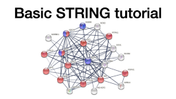

## Learning objectives

In these exercises, we will use the [STRING](https://string-db.org/) database through its respective web interface. The exercises will teach you how to:

* retrieve a STRING network for a protein of interest or a list of genes/proteins from a high-throughput experiment
* interpret the different visual representations
* inspect the evidence behind an interaction
* understand the query parameters and customize searches
* inspect functional enrichment for a network of interest

## Exercise 1

### 1.1 Single protein query

We will first retrieve a STRING network for human insulin receptor (INSR). Go to <https://string-db.org/>, open the **Protein by name** search interface, and type **INSR** in the field **Protein Name**. You can either specify **Homo sapiens** in the **Organism** field or leave it on **auto-detect**. Click **SEARCH**. You will first be presented with a disambiguation page, on which you can specify that the protein you are interested in is the human protein INSR, and press **Continue** to view the protein network.

_Why are there multiple lines connecting the same two proteins?_

### 1.2 Visual representations

The STRING web interface provides several different visual representations of the network. The **Settings** tab below the network view allows you to change between different visual representations of the same network. Try changing the meaning of network edges between the **confidence** and **evidence** views; do not forget to press the **UPDATE** button.

_Which information is shown for the edges in each representation?_

### 1.3 Evidence viewers

A key feature of the STRING web interface is the evidence viewers. One should not rely purely on the confidence scores; it is important to inspect the actual evidence underlying an interaction before relying on it, for example, for designing experiments.

_Which types of evidence support the interaction between insulin receptor (INSR) and insulin receptor substrate 1 (IRS1)?_

Further detail on the evidence of an interaction can be seen in a popup by clicking on the corresponding edge in the network. Click on the edge between INSR and IRS1 to view its popup; you may need to move the nodes to make this easier.

_Which type of evidence gives the largest contribution to the confidence score 0.999?_

Click on the **Show** button to view the experimental evidence for the interaction.

_Which types of experiments support this interaction?_

<!-- Since the predominant source of evidence is automatic text mining, it is always wise to read the underlying text to manually validate the results. Click on the **Show** button to view the text based on which the two proteins were connected. Click **View abstract** for a given entry to see the complete abstract rather than only the title.

_Do the abstracts all mention both the protein and the disease? Do they all use the same name for the protein?_
 -->

## Exercise 2

In this exercise, we will work with the list of 541 proteins associated with epithelial ovarian cancer (EOC) as identified by phosphoproteomics in the study by [Francavilla et al.](https://doi.org/10.1016/j.celrep.2017.03.015). An adapted, simplified version of their results table can be downloaded [here](/assets/Francavilla2017CellRep.tsv). We recommend using Excel or a similar program to open the file. 

### 2.1 Multiple proteins query 

We will first retrieve a network for the proteins from the study. Go to <https://string-db.org/>, open the **Multiple proteins** search interface, and paste the list of UniProt accession numbers from the _UniProt_ column in the table into the field **List Of Names**. Specify **Homo sapiens** in the **Organism** field and click **SEARCH**. You will first be presented with a disambiguation page, on which you can verify that the proteins you entered are correctly mapped. Press **Continue** to view the protein network.

_How many nodes and edges are in the resulting network?_

### 2.2 Query parameters

The **Settings** tab allows you to modify detailed parameters for the search, such as the **network type**, the **minimum required interaction score**, and the types of evidence to use (**active interaction sources**).

Change the **minimum required interaction score** to high confidence (0.700).

_How does changing the confidence influence the set of interactions shown?_

Change the network type from **full STRING network** to **physical subnetwork**. Do not forget to press the **UPDATE** button.

_How does changing the network type influence the set of interactions shown in the network?_

Change the **minimum required interaction score** back to medium confidence (0.400). 

_How does the network look now?_

Change the network view from *confidence* to *evidence* and press the **UPDATE** button.

_What evidence types are available for the physical interactions? Are there more or fewer evidence types than in the full STRING network?_

### 2.3 Functional enrichment

Another key feature of STRING is the Analysis, where one can find network stats and functional enrichment computed for the network. Go to the **Analysis** tab below the network and look at the different enrichment categories. 

_How many categories contain enriched annotation terms?_

Look at one of the categories you find interesting, for example the **Reactome Pathways**, and explore it in more detail.

_What information is shown in each line of the table? How can you find out more about this annotation term?_

Press on the first 3 pathways and you will see a color showing up next to each of them. Scroll up to the network view and find the proteins annotated by these pathways.

_Do the pathways annotate the same set of proteins or not?_

## Supporting lectures

The theoretical background for these exercises is covered in these short online lectures:

## Supporting literature

Szklarczyk D, Gable AL, Nastou KC, Lyon D, Kirsch R, Pyysalo S, Doncheva NT, Legeay M, Fang T, Bork P, Jensen LJ and von Mering C (2021). The STRING database in 2021: customizable protein-protein networks, and functional characterization of user-uploaded gene/measurement sets. *Nucleic Acids Research*, **49**:D605–D612.  
[Abstract](https://pubmed.ncbi.nlm.nih.gov/33237311) [Full text](https://doi.org/10.1093/nar/gkaa1074)

