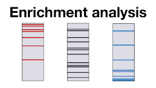

## Learning objectives

In these exercises, we will use the [stringApp](http://apps.cytoscape.org/apps/stringApp) for [Cytoscape](http://cytoscape.org/) to retrieve molecular networks from the [STRING](https://string-db.org/) database for genes associated with diseases according to the [DISEASES](https://diseases.jensenlab.org/Search) database. The exercises will teach you how to:

* retrieve networks for a disease
* merge and compare networks
* select proteins by attributes
* layout and visually style the resulting networks
* perform enrichment analyses and visualize the results
* identify functional modules through network clustering

## Prerequisites

To follow the exercises, please make sure that you have the latest version of Cytoscape installed. Then start Cytoscape and update the current apps if necessary by checking the **App Updates** icon in the right-most corner of the menu bar. 

The exercises require you to have certain Cytoscape apps installed. Go to the [Cytoscape App Store](https://apps.cytoscape.org/) in your web browser and search for [stringApp](http://apps.cytoscape.org/apps/stringApp), select the app and press the **Install** button to install it. Similarly, make sure you have the [Omics Visualizer](https://apps.cytoscape.org/apps/OmicsVisualizer), [yFiles Layout Algorithms](https://apps.cytoscape.org/apps/yfileslayoutalgorithms) and [clusterMaker2](https://apps.cytoscape.org/apps/clustermaker2) apps installed before switching back to Cytoscape.

If you are not already familiar with the STRING database or stringApp, we highly recommend that you go through the [STRING exercises](/training/string/) to learn about the underlying data and the [stringApp exercises](/training/stringapp/) to get familiarized with Cytoscape and stringApp.

## Exercise 1

In this exercise, we will retrieve several different disease networks and compare them by creating the union of their nodes and edges as well as by visualizing which nodes belong to which diseases.

### 1.1 Disease queries

Go to the menu **File → Import → Network from Public Databases**. In the import dialog, choose **STRING: disease query** as **Data Source**, type into the **Enter disease term** field one disease name and set the **Confidence (score) cutoff** to **0.7**. When you press **Import**, stringApp will retrieve a STRING network for the top-100 proteins associated with the chosen disease. Repeat this for **three** of the following diseases: _Pancreatic cancer_, _Acute pancreatitis_, _Anxiety disorder_, _Sleep disorder_, _Intestinal disease_, and _Diabetes mellitus_.

_Which additional attribute column do you get in the **Node Table** for a disease query compared to a protein query? Hint: check the last column._

Now, go to the _stringdb::disease score_ column, click on the column name and choose **Rename column**. For each network, change the name of the column to reflect the name of the disease, e.g. _Pancreatic cancer_ or _disease PC_.

### 1.2 Integrate networks

Cytoscape provides functionality to merge two or more networks, building either their union, intersection or difference. We will now merge the disease networks so that we can identify the overlap and differences between them. Use the Merge tool (**Tools → Merge → Networks...**) and make sure the **Union** tab is chosen. Then, select the disease networks from **Available Networks** list (for example ‘String Network - Pancreatic cancer’, ‘String Network - Acute pancreatitis’, and ‘String Network - Anxiety disorder’). Click on **>** to add them to the list of **Networks to Merge** and click **Merge**.

_How many nodes and edges are in the merged network?_

In the next step, we need to retrieve all the interactions between the nodes that were not in the same disease network since those are not yet included in the network. To do so, we first remove all edges by choosing **Apps → STRING → Change confidence or type** from the Cytoscape menu. In the dialog, we set the **Confidence cutoff** to **1.0** and press **OK**. Then, we open the same dialog again, change the **Confidence cutoff** back to **0.7** and press *OK*. In this way, we make sure that all interactions above the confidence cutoff between **all** proteins in the current network are retrieved. 

_How many edges do we have now in the merged network?_

We can change the visualization of the merged network to look like a STRING network. Select **Style** in the **Control Panel** and click on the drop-down menu to change the style from **default** to **STRING - Pancreatic cancer**. We can also create a new style by copying the current style from the menu next to the styles drop-down list and renaming it to _STRING merged diseases_. 

To improve the layout of the merged network, go to **Layout → Apply Preferred Layout** and then to **Layout → yFiles Remove Overlaps**.

### 1.3 Use selection filters

Now, we can explore the disease scores and check how many proteins are associated with more than one disease by using Cytoscape's built-in selection filters (**Filter** tab located underneath the **Style** tab). Click the **ᐩ** button, choose **Column filter** from the drop-down menu, and select one of the disease score columns you renamed in Exercise 1.1. The filtering criteria will automatically bet set to **is** and then a range for the score. Add a filter for the other two diseases in the network by clicking on the **ᐩ** button and selecting the respective disease score column. All three filters are connected with an _AND_ logic, which means that a node is selected only if it fulfills all three conditions. 

_How many nodes (proteins) are common to all three diseases? And how many are common to some of the pairs of diseases? Note that you can see the nodes common to a pair by either deleting one of the three filters OR by setting the filtering criteria to **is not**._

### 1.4 Visualize disease associations

In the next step, we will import the disease scores into a different table using the _Omics Visualizer_ app. Go to **Apps → Omics Visualizer → Import form node table**. In the resulting dialog, we will see all node attribute columns, including the ones created in Exercise 1.1. Move the three columns containing the disease scores from **Available columns** to **Selected columns** using the **>** button and then click **Next** and **Import**. 

A new table should appear in the Cytoscape _Node Panel_ in the **Omics Visualizer Tables** tab. This table contains three columns (_shared name_, _value_, and _source_) and for each node, one row for each column we selected in the previous step, in this case three. Since not all nodes are associated with all three diseases, in some cases the _value_ column is empty. We can filter the table to show only the rows that contain any disease score, since this would be useful for the visualization we want to make. Press the **filter icon** (second icon just above the table), choose the **_value_** column and the **_is not null_** criteria. Now you can press **Apply** and then the **Close** button. 

_How many rows remain after filtering? Out of how many? Do you have an idea why the filtered rows are such a round number?_

To visualize which nodes are associated with which disease, you can use the **pie chart icon** (5th icon in the row above the table). In the resulting dialog, choose **_source_** in the **Values** column, keep the **Mapping** to _Discrete_ and **Labels** to _NONE_. Pressing the **Next** button will show the next page of settings. We can pick other colors or keep the defaults and press **Draw**. As a result, the nodes are colored based on their association with one, two or all three diseases we combined in this network. Press the **Legend** icon (last icon) and confirm with the **Create** button to let Omics Visualizer create a legend of the visualization. 

_Do you observe an overlap between the three diseases? Is the overlap more, less or as much as as you would expect for these specific diseases?_

### 1.5 Enrichment analysis

To find out more about the biological functions and processes related to the proteins in the merged network, we can perform enrichment analysis by selecting **Apps → STRING Enrichment → Retrieve functional enrichment** and press **OK**.

## Exercise 2

In this exercise, we will analyze the integrated disease network by performing network clustering and functional enrichment. 

### 2.1 Network clustering

Starting from the merged network, we will use the MCL algorithm to identify clusters of tightly connected proteins within the network. To do that, press the **Cluster network (MCL)** button in the **STRING Results panel** on the right side of the network view. Set the **granularity parameter (inflation value)** to **5** and click **OK** to start the clustering. The _clusterMaker_ app will now run the algorithm and automatically create a network showing the clusters. To remove the node overlaps, go to **Layout → yFiles Remove Overlaps**.

_How many big clusters are there (with more than 10 nodes)? Are any of the clusters disease-specific or do they contain proteins associated with all three diseases? Or only certain pairs of diseases?_

<em>Alternative instructions for clustering</em>

Go to the menu <b>Apps → clusterMaker → ClusterMaker Cluster Network → MCL Cluster</b>>. Set the <b>Granularity parameter (inflation value)</b> to 4 and choose the <b>stringdb::score</b> attribute (i.e. the overall STRING confidence score) as <b>Array Sources</b>, select the option <b>Create new clustered network</b>, and click OK to start the clustering. The app will now run the algorithm and automatically create a network showing the clusters.

### 2.2 Group-wise functional enrichment

Now we will perform functional enrichment analysis on each of the bigger clusters separately by selecting the menu **Apps → STRING Enrichment → Retrieve group-wise functional enrichment**. In the resulting dialog, press **Advanced** to show the advanced options and set the **minimum group size** to **10**, in order to retrieve enrichment results only for clusters with at least 10 nodes. Press **OK** and the **STRING enrichment** table will be populated with several tables, one for each cluster. You can explore the results of each of them separately. 

_Can you briefly characterize the three largest clusters in terms of their functionality? What distinguishes them?_

## Supporting lectures

The theoretical background for these exercises is covered in these short online lectures:

## Supporting literature

Doncheva NT, Morris JH, Gorodkin J and Jensen LJ (2019). Cytoscape stringApp: Network analysis and visualization of proteomics data. *Journal of Proteome Research*, **18**:623-632.  
[Abstract](https://www.ncbi.nlm.nih.gov/pubmed/30450911) [Full text](https://doi.org/10.1021/acs.jproteome.8b00702) [Preprint](https://doi.org/10.1101/358283)

