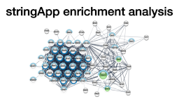

## Learning objectives

In these exercises, we will use the [stringApp](http://apps.cytoscape.org/apps/stringApp) for [Cytoscape](http://cytoscape.org/) to retrieve molecular networks from the [STRING](https://string-db.org/) database. The exercises will teach you how to:

* retrieve networks for proteins of interest
* retrieve networks for a disease
* layout and visually style the resulting networks
* import external data and map them onto a network
* identify functional modules through network clustering
* perform enrichment analyses 
* merge and compare networks
* select proteins by attributes

## Prerequisites

To follow the exercises, please make sure that you have the latest version of Cytoscape installed. Then start Cytoscape and go to **Apps → App Manager** to check for new apps, install them and update the current ones if necessary. The exercises require you to have certain Cytoscape apps installed. Search for the **stringApp** in the search field; if it is not already installed, select it and press the **Install** button to install it. Similarly, make sure you have the **yFiles Layout Algorithms**, and **clusterMaker2** apps installed before closing the App Manager.

If you are not already familiar with the STRING database, we highly recommend that you go through the short [STRING exercises](/training/string/) to learn about the underlying data before working with them in these exercises.

## Exercise 1

In this exercise, we will perform some simple queries to retrieve molecular networks based on a protein and a disease.

### 1.1 Protein queries

Go to the menu **File → Import → Network from Public Databases**. In the import dialog, choose **STRING: protein query** as **Data Source** and type your favorite protein into the **Enter protein names or identifiers** field (e.g. SORCS2). You can select the appropriate organism by typing the name (e.g. Homo sapiens). The **Maximum number of interactors** determines how many interaction partners of your protein(s) of interest will be added to the network. By default, if you enter only one protein name, the resulting network will contain 10 additional interactors. If you enter more than one protein name, the network will contain only the interactions among these proteins, unless you explicitly ask for additional proteins.

Unless the name(s) you entered give unambiguous matches, a disambiguation dialog will be shown next. It lists all the matches that the stringApp finds for each ambiguous query term and selects the first one for each. Select the right one(s) you meant and continue by pressing the **Import** button.

[Import SORCS2 network](cycmd:string protein query query=SORCS2 taxonID=9606){: .btn .btn--cybrowser .btn--primary}

_How many nodes are in the resulting network? What types of information do the **Node Table** and the **Edge Table** provide?_

### 1.2 Disease queries

Go to the menu **File → Import → Network from Public Databases**. In the import dialog, choose **STRING: disease query** as **Data Source** and type a disease of interest into the **Enter disease term** field (e.g. temporal lobe epilepsy). The stringApp will retrieve a STRING network for the top-N proteins (by default 100) associated with the disease.

The next dialog shows all the matches that the stringApp finds for your disease query and selects the first one. Make sure to select the intended disease before pressing the **Import** button to continue.

_Which additional attribute column do you get in the **Node Table** for a disease query compared to a protein query? Hint: check the last column._

## Exercise 2

In this exercise, we will work with the list of genes identified as potential targets in temporal lobe epilepsy using RNA-sequencing by [Kjær et al.](https://doi.org/10.1093/brain/awz265) to perform typical network import and visualization tasks. We recommend using Excel or a similar program to open the file, which you can download from [here in TSV format](/assets/teaching_dsd/candidates_consensus.tsv) and [here in XLSX format](/assets/teaching_dsd/candidates_consensus.xlsx). 

### 2.1 Protein network retrieval

Go to the menu **File → Import → Network from Public Databases**. In the import dialog, choose **STRING: protein query** as the **Data Source** and paste the list of gene names from the _GeneSymbol_ column in the table into the **Enter protein names or identifiers** field. Keep the other query settings as they are and proceed with the **Import** button. Once the network appears, check that **View → Always Show Graphics Details** is enabled for a detailed view of the network.

[Import network](cycmd:string protein query query="" taxonID=9606 limit=0){: .btn .btn--cybrowser .btn--primary}

_How many nodes and edges are there in the resulting network? Do the proteins all form a connected network? Why?_

### 2.2 Discrete color mapping

Cytoscape allows you to map attributes of the nodes and edges to visual properties such as node color and edge width. Here, we will map drug target information from the [Pharos](https://pharos.nih.gov/idg/targets) database to the node border color. This data is contained in the node attribute called **target development level** and can be on of the four categories: Tbio, Tchem, Tclin, and Tdark. See more about the different categories [here](http://juniper.health.unm.edu/tcrd/).

Select **Style** from the side menu in the left panel (it is between **Network** and **Filter**). First, we will change the border width and then the border color. Find the row **Border Width** and click on the first column (**Def.**). Enter the value **10.0** and press the **OK** button, which will show a gewy border around all nodes. Next, click the **◀** button to the right of the property you want to create a mapping for, in this case **Border Paint**. Change **Column** from name to **(T) development level**, which is the node column containing the data that you want to use. Choose **Discrete Mapping** from the **Mapping Type** dorp-down menu. This action will present you with a list of all the different values of the attribute that exist in the network, in this case Tbio, Tchem, Tclin, and Tdark.

To color the border of the proteins with a given target development level, first click the field to the **right** of an attribute value, i.e. **Tbio**, then click the ⋯ button and choose a color from the color selection dialog.

_How many of the proteins in the network are have a Tclin target?_

There are many proteins with Tbio targets in the network. We can avoid counting them manually by creating a selection filter in the **Filter** tab (located underneath **Style**). Click the **ᐩ** button and choose **Column filter** from the drop-down menu. Then, find and select the attribute **(T) Node: development level**. Write **Tbio** in the text field to select all nodes with this annotation.

_How many proteins with a Tbio target are in the network?_

### 2.3 Data import

Network nodes and edges can have additional information associated with them that we can load into Cytoscape and use for visualization. We will import the data from the same table.

To import the node attributes file into Cytoscape, first select the **Node Table** tab at the bottom of the dialog and then go to **File → Import → Table from File**. In the resulting dialog entitled Import Columns From Table, use the drop-down menu next to **Where to Import Table Data** to choose the option **To a Network Collection**. Next, change the **Key Column for Network** from **shared name** to **query term** and click **OK**.

_Do you see the columns from the Excel table in the Node Table in Cytoscape?_

<em>Detailed explanation: Understanding Cytoscape's data import</em>

The preview in the bottom of the import dialog will show how the file is interpreted given the current settings and will update automatically when you change them. To change the default interpretation of a column, click the arrow in its column heading. For example, you can decide whether the column is imported or not by changing the <strong>Meaning</strong> of the column (hover over each symbol with the mouse to see what they mean). This column-specific dialog will also allow you to change the column name and type.

Another important part is that you need to map unique identifiers between the entries in the data and the nodes in the network. The key point of this is to identify which nodes in the network are equivalent to which entries in the table. This enables mapping of data values into visual properties like Fill Color and Shape. This kind of mapping is typically done by comparing the unique identifier for each node (Key Column for Network) with the unique identifier for each data row in the table (marked with key symbol).

The <strong>Key Column for Network</strong> can be changed using a drop-down menu and allows you to set the node attribute column that is to be used as key to map to. In this case it is <strong>query term</strong> because this attribute contains the UniProt accession numbers you entered when retrieving the network. You can also change the Key by pressing the key button for the column that is to be used as key for mapping values in the dataset. In this case it is the first column in the table called UniProt, from where you copied the identifiers.

If there is a match between the value of a Key in the dataset and the value the Key Column for Network field in the network, all attribute–value pairs associated with the element in the dataset are assigned to the matching node in the network. You will find the imported columns at the end of the Node Table.

### 2.4 Continuous color mapping

Now, we want to color the nodes according to their differential expression. From the left panel side menu, select **Style** (it is underneath **Network**). Then click on the **◀** button in the **Fill Color** row and set **Column** to the node attribute **l2FC**. Since this is a numeric value, we will use the **Continuous Mapping** as the **Mapping Type**, and set a color gradient for how differentially expressed each gene is. The default Cytoscape color gradient blue--white--red already gives a nice visualization of the log ratio.

_Are the up-regulated nodes grouped together?_

## Exercise 3

In this exercise, we will focus on common network analysis tasks such as clustering and functional enrichment. 

### 3.1 Network clustering

Next, we will use the MCL algorithm to identify clusters of tightly connected proteins within the network. To do that, press the **Cluster network (MCL)** button in the **STRING Results panel** on the right side of the network view. Keep the default **granularity parameter (inflation value)** set to **4** and click **OK** to start the clustering. The clusterMaker app will now run the algorithm and automatically create a network showing the clusters.

<em>Alternative instructions for clustering</em>

Go to the menu <b>Apps → clusterMaker → MCL Cluster</b>>. Set the <b>Granularity parameter (inflation value)</b> to 4 and choose the <b>stringdb::score</b> attribute (i.e. the overall STRING confidence score) as <b>Array Sources</b>, select the option <b>Create new clustered network</b>, and click OK to start the clustering. The app will now run the algorithm and automatically create a network showing the clusters.

_How many clusters have at least 10 nodes?_

### 3.2 Functional enrichment

We will work with the largest cluster in the network (it should be in the upper left corner). Select the nodes of this cluster by holding down the modifier key (Shift on Windows, Ctrl or Command on Mac) and then left-clicking and dragging to select multiple nodes. The nodes will turn yellow if they are selected properly. Then, create a new network by clicking on the **New Network from Selection** button and choosing the option **From Selected Nodes, All Edges** or via the menu item **File → New Network → From Selected Nodes, All Edges**.

_How many nodes and edges are there in this cluster?_

After making sure that no nodes are selected in the current network, go to the menu **Apps → STRING Enrichment → Retrieve functional enrichment** or use the **Functional Enrichment** button in the **Nodes tab** of the **STRING Panel** on the right side. Then, select the original, not clustered network ‘String Network’ as **Background** (instead of ‘genome’) and click **OK**. A new **STRING Enrichment tab** will appear in the **Table Panel** on the bottom. It contains a table of enriched terms and corresponding information for each enrichment category. You can see which proteins are annotated with a given term by selecting the term in the **STRING Enrichment panel** and you can see the terms annotating a given node by slecting it.

_How many statistically significant terms are in the table? Which is the most significant term for each of the categories GO Biological Process, Reactome and KEGG Pathways? Hint: Look at the FDR (false discovery rate) value column and use the **Filter** button to select individual categories._

## Exercise 4

In this exercise, we will show you how to compare two different networks.

### 4.1 Overlap with DISEASES network

Cytoscape provides functionality to merge two or more networks, building either their union, intersection or difference. We will now merge the network we have from the DISEASES query (_STRING network - temporal lobe epilepsy_) with the one we have from the data, so that we can identify the overlap between them. Use the Merge tool (**Tools → Merge → Networks...**) and select the **Intersection** button. Then, select the two STRING networks from **Available Networks** list. Click on **>** to add them to the list of **Networks to Merge** and click **Merge**.

_How many nodes are in the intersection?_

### 4.2 Integrate networks

Now we will make the union of the intersection network, which contains the disease scores, and the experimental network. Use the **Merge** tool again to make the **Union** of the merged network and _STRING Network_. Make sure that the new merged network has the same number of nodes and edges as _STRING Network_, and that some nodes have a disease score (look for the column with this name and sort it by clicking on the column name).

_Which protein from the experiment has the highest disease score?_

Now, we can change the visualization of the merged network to look like a STRING network and to be able to identify proteins with a high disease confidence score. Specifically, we will change the size of the nodes in function of their **disease score**. Select **Style** in the **Control Panel** and click on the drop-down menu to change the style from **default** to **STRING style v1.5**. Then, click on the **Lock node width and height** option to enable it so that the nodes have only one attribute **Size** instead of two attributes **Height** and **Width**. Modify the values so that by default a node size is 30. To change the default value, you have to click on the default **35.0** value at the left of the Size attribute. Click on the ◀ button to add a continuous mapping of the **Size** attribute using the **disease score**. The mapping should go from 40 for the lowest disease score to 80 for the highest score. To change the mapping values, first double click on the chart and then double click on the triangle corresponding to the value you want to modify and set the value you want (40 and 80). Remember to _show the graphics details_ as well as to use a layout that allows you to see all nodes in the network (e.g. **yFiles Organic Layout**).

_Can you find the protein with the highest disease score in the network view?_

## Supporting lectures

The theoretical background for these exercises is covered in these short online lectures:

## Supporting literature

Doncheva NT, Morris JH, Gorodkin J and Jensen LJ (2019). Cytoscape stringApp: Network analysis and visualization of proteomics data. *Journal of Proteome Research*, **18**:623-632.  
[Abstract](https://www.ncbi.nlm.nih.gov/pubmed/30450911) [Full text](https://doi.org/10.1021/acs.jproteome.8b00702) [Preprint](https://doi.org/10.1101/358283)

